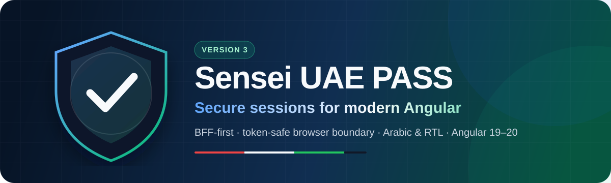
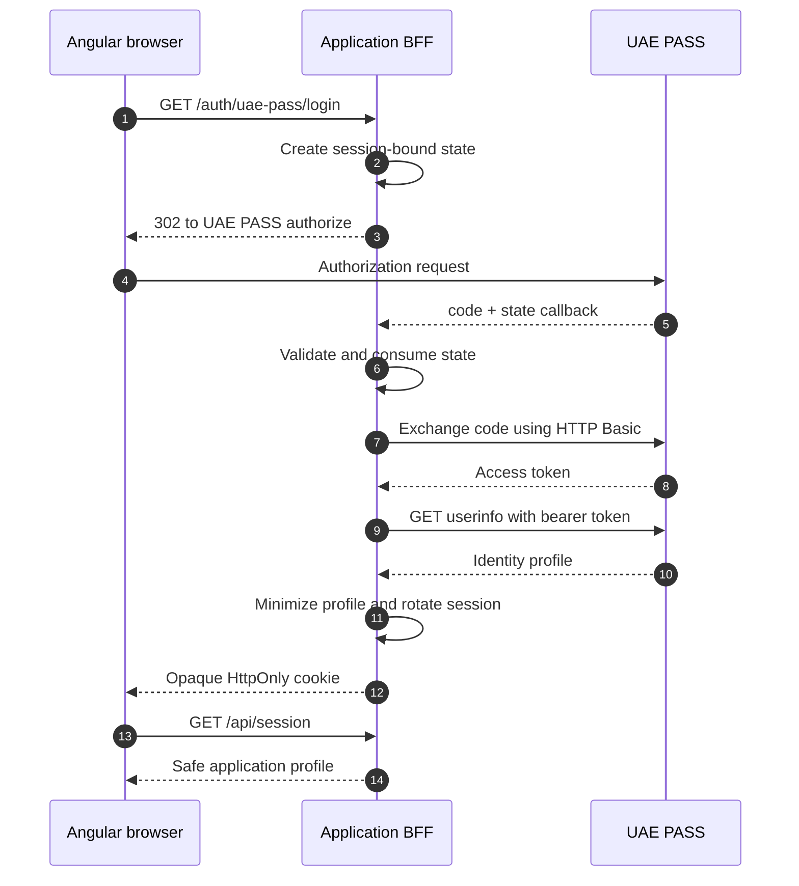

<div align="center">



# Sensei UAE PASS for Angular

The BFF-first Angular session client for UAE PASS integrations.

Keep OAuth transactions, provider tokens, and full identity data on the server while
Angular works with a small, typed application-session API.

[Documentation](https://sensei-5.gitbook.io/sensei-uaepass/) ·
[Quick start](#quick-start) ·
[Security model](#security-by-design) ·
[UAE PASS contract](docs/security/uae-pass-contract.md) ·
[Migration guide](docs/getting-started/migration-v3.md)

[](https://github.com/comrade1996/sensei-uaepass/actions/workflows/ci.yml)
[](https://github.com/comrade1996/sensei-uaepass/actions/workflows/codeql.yml)
[](https://www.npmjs.com/package/sensei-uaepass)
[](https://www.npmjs.com/package/sensei-uaepass)
[](#quality-you-can-see)
[](#compatibility)
[](LICENSE)

> Community-maintained and built against the published UAE PASS web contract.
> This project is not certified, approved, or endorsed by UAE PASS.

</div>

## Why Sensei

Traditional SPA OAuth integrations expose authorization codes and tokens to browser
JavaScript. Sensei version 3 uses a Backend-for-Frontend (BFF) boundary instead:

- Angular never receives UAE PASS access, refresh, or ID tokens.
- The BFF owns state, callback processing, token exchange, user info, and logout.
- The browser receives only an opaque `HttpOnly` session cookie.
- Application code receives a minimized, runtime-validated profile.
- The public Angular API is small, signal-based, standalone, and typed.

## At a glance

| Capability              | What you get                                                                                                  |
| ----------------------- | ------------------------------------------------------------------------------------------------------------- |
| Secure browser boundary | No provider tokens in Angular state, storage, URLs, or browser-visible API responses                          |
| Modern Angular          | Signals, standalone component, `OnPush`, typed configuration and errors                                       |
| UAE PASS web flow       | Published staging/production endpoints, HTTP Basic token exchange, user info, and provider logout             |
| English and Arabic      | Validated `ui_locales`, translated button text, Arabic assets, and RTL-friendly UI                            |
| Defensive BFF           | One-time state, session rotation, CSRF/origin checks, rate limits, timeouts, bounded responses, and safe logs |
| Production guardrails   | Shared-store requirement, secure-cookie controls, package validation, CodeQL, SBOM, and dependency review     |

## Architecture



The browser-to-BFF boundary is the key design decision. Provider credentials, OAuth
codes, PKCE verifiers when enabled, tokens, and complete UAE PASS profiles remain on
the server.

## Quick start

### 1. Install

```bash
npm install sensei-uaepass
```

### 2. Configure Angular

```ts
import { provideHttpClient, withFetch } from '@angular/common/http';
import { provideUaePass } from 'sensei-uaepass';

export const appConfig = {
  providers: [
    provideHttpClient(withFetch()),
    provideUaePass({
      loginUrl: '/auth/uae-pass/login',
      sessionUrl: '/api/session',
      logoutUrl: '/auth/logout',
      language: 'en',
    }),
  ],
};
```

### 3. Add the standalone button

```ts
import { Component } from '@angular/core';
import { UaePassLoginButtonComponent } from 'sensei-uaepass';

@Component({
  standalone: true,
  imports: [UaePassLoginButtonComponent],
  template: `<uae-pass-login-button />`,
})
export class LoginComponent {}
```

<p align="center">
  
  <br>
  
</p>

### 4. Read the application session

```ts
import { Component, inject } from '@angular/core';
import { UaePassAuthService } from 'sensei-uaepass';

@Component({
  standalone: true,
  template: `
    @if (auth.isAuthenticated()) {
      <p>Welcome {{ auth.profile()?.fullnameEN }}</p>
      <button type="button" (click)="auth.logout()">Sign out</button>
    }
  `,
})
export class AccountComponent {
  readonly auth = inject(UaePassAuthService);
}
```

### 5. Run the BFF

The maintained Node.js/Express reference implementation lives in
[`examples/bff/nodejs-express`](examples/bff/nodejs-express/README.md).

```powershell
$env:NODE_ENV='development'
$env:APP_ORIGIN='http://localhost:4200'
$env:ALLOWED_ORIGINS='http://localhost:4200'
$env:UAE_PASS_ENVIRONMENT='staging'
$env:UAE_PASS_CLIENT_ID='your-staging-client-id'
$env:UAE_PASS_CLIENT_SECRET='your-staging-client-secret'
$env:UAE_PASS_REDIRECT_URI='http://localhost:3001/auth/uae-pass/callback'
$env:UAE_PASS_LOGOUT_REDIRECT_URI='http://localhost:4200'
npm run start:full
```

The in-memory store is intentionally limited to development. Production startup
requires a shared session-store implementation.

## Public API

### Signals

- `status()` — authentication lifecycle status
- `profile()` — minimized application profile
- `isAuthenticated()` — true only for a validated server session
- `error()` and `errorCode()` — safe client-side failure information

### Actions

- `login(returnPath?)`
- `restoreSession()`
- `logout()`
- `resetError()`

There is deliberately no public token API and no browser-storage mode.

## Security by design

| Threat                       | Control                                                           |
| ---------------------------- | ----------------------------------------------------------------- |
| Token theft through XSS      | UAE PASS tokens never cross into browser-visible state or storage |
| Login CSRF                   | Cryptographically random, session-bound, one-time state           |
| Callback replay              | Transaction is consumed before token exchange                     |
| Session fixation             | Opaque session identifier rotates after authenticated user info   |
| Logout CSRF                  | Exact origin allowlist plus an in-memory CSRF token               |
| Open redirect                | Only bounded local return paths are accepted                      |
| Data leakage                 | Minimized profiles and metadata-only structured logs              |
| Multi-instance inconsistency | Production rejects the development memory store                   |

S256 PKCE is available but disabled by default because it is not documented in the
published UAE PASS web contract. Enable it only when UAE PASS confirms it for the
onboarded client.

Read the [threat model](docs/security/threat-model.md), [BFF architecture](docs/security/bff-architecture.md),
[data-minimization guidance](docs/security/data-minimization.md), and
[production checklist](docs/deployment/production-checklist.md).

## UAE PASS contract alignment

The reference BFF was checked against the official UAE PASS web documentation and the
Authentication APIs Postman Collection V2:

- fixed staging and production endpoints;
- authorization-code flow with validated `state`;
- token parameters in the query string;
- HTTP Basic client authentication and empty multipart token request;
- bearer-authenticated user-info request;
- `ui_locales=en|ar`;
- UAE PASS provider logout with a registered redirect URI.

See the [contract matrix and official sources](docs/security/uae-pass-contract.md).
Client credentials, exact redirect URIs, scopes, attributes, `acr_values`, and
optional PKCE support remain specific to each UAE PASS onboarding agreement.

## Quality you can see

The version 3 baseline is enforced by `npm run validate`.

| Metric     | Current baseline | Required gate |
| ---------- | ---------------: | ------------: |
| Statements |           88.15% |           80% |
| Branches   |           76.82% |           70% |
| Functions  |           92.85% |           80% |
| Lines      |           90.78% |           80% |

Every validation run includes:

- Angular library, demo, and BFF tests;
- ESLint and Prettier;
- production library and demo builds;
- package-content, publishing, and type-resolution checks;
- Markdown lint;
- production dependency audit.

CI runs on Node.js 22.12 and 24 and tests Angular 19.2 minimum, latest Angular 19,
Angular 20 minimum, and latest Angular 20.

## Compatibility

| Sensei UAE PASS | Angular   | RxJS  | Node.js                       |
| --------------- | --------- | ----- | ----------------------------- |
| 3.x             | 19.2–20.x | 7.8.x | 22.12+, 24.x                  |
| 2.x             | 19.2–20.x | 7.8.x | 22.12+, 24.x                  |
| 1.x             | 19.x      | 7.8.x | Angular 19-supported versions |

Version 3 is intentionally breaking because it removes the browser-token
architecture. See the [version 3 migration guide](docs/getting-started/migration-v3.md).

## Documentation

| Start here                                                    | Security and operations                                         |
| ------------------------------------------------------------- | --------------------------------------------------------------- |
| [Installation](docs/getting-started/installation.md)          | [Threat model](docs/security/threat-model.md)                   |
| [Quick start](docs/getting-started/quickstart.md)             | [UAE PASS contract](docs/security/uae-pass-contract.md)         |
| [Angular configuration](docs/configuration/uaepass-config.md) | [Production checklist](docs/deployment/production-checklist.md) |
| [Node.js BFF](docs/examples/node-bff.md)                      | [Security policy](SECURITY.md)                                  |
| [Troubleshooting](docs/troubleshooting/common-errors.md)      | [Data minimization](docs/security/data-minimization.md)         |

## Repository map

```text
projects/uae-pass/                  Angular package
projects/demo/                      Token-free Angular demo
examples/bff/nodejs-express/        Reference BFF
docs/                               GitBook documentation
.github/workflows/                  CI, CodeQL, and release automation
```

## Development

Requirements: Node.js 22.12 or 24, npm 10+, and Chrome or Chromium.

```bash
git clone https://github.com/comrade1996/sensei-uaepass.git
cd sensei-uaepass
npm ci
npm run validate
```

Useful commands:

```bash
npm run dev          # BFF and Angular demo
npm test             # Angular, demo, and BFF tests
npm run build        # Library and demo production builds
npm run package:check
```

## Contributing and security

Focused issues and pull requests are welcome. Read [CONTRIBUTING.md](CONTRIBUTING.md)
before changing public APIs, authentication behavior, or documentation.

Do not open a public issue for a suspected vulnerability. Follow the private
reporting process in [SECURITY.md](SECURITY.md).

If this project helps your integration, consider
[starring the repository](https://github.com/comrade1996/sensei-uaepass/stargazers)
so other Angular teams can find it.

## License

[MIT](LICENSE) © Sensei UAE PASS contributors.
