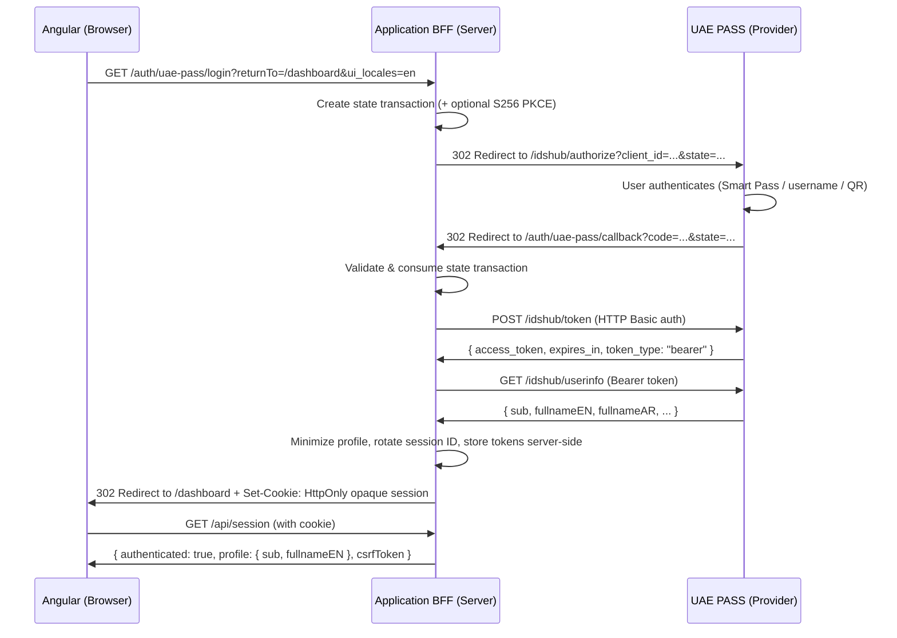
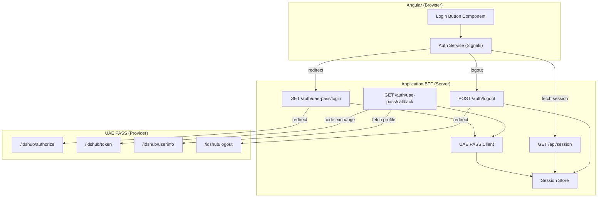
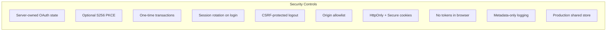

# 🥋 Sensei UAE PASS for Angular

<p align="center">
  <strong>BFF-first Angular session client for UAE PASS digital identity integration</strong>
</p>

<p align="center">
  <a href="https://www.npmjs.com/package/sensei-uaepass"></a>
  <a href="https://www.npmjs.com/package/sensei-uaepass"></a>
  <a href="./LICENSE"></a>
  <a href="https://angular.dev"></a>
  <a href="https://nodejs.org"></a>
  <a href="https://www.typescriptlang.org/"></a>
  <a href="https://rxjs.dev"></a>
  <a href="https://github.com/comrade1996/sensei-uaepass/actions"></a>
  <a href="https://github.com/comrade1996/sensei-uaepass/pulls"></a>
  <a href="docs/ai-agent-guide.md"></a>
</p>

<p align="center">
  <a href="#quick-start-">🚀 Quick Start</a> &nbsp;&bull;&nbsp;
  <a href="#architecture">📐 Architecture</a> &nbsp;&bull;&nbsp;
  <a href="#api-reference">📚 API Reference</a> &nbsp;&bull;&nbsp;
  <a href="docs/SUMMARY.md">📖 Full Docs</a> &nbsp;&bull;&nbsp;
  <a href="docs/ai-agent-guide.md">🤖 AI Agent Guide</a> &nbsp;&bull;&nbsp;
  <a href="#security-properties">🔒 Security</a>
</p>

---

**`sensei-uaepass`** is a BFF-first Angular session client for [UAE PASS](https://uaepass.ae) integrations.
The Angular package handles session UI and state using **Angular Signals**; your Backend-for-Frontend owns
OAuth transactions, tokens, identity validation, and logout.

> 🤖 **AI-friendly package** — includes a complete [AI Agent Guide](docs/ai-agent-guide.md) with the full
> API surface, BFF contract, integration patterns, and gotchas so any AI coding assistant can integrate
> this package correctly — even with a non-Node.js backend.

> ⚠️ This community package is designed with reference to published UAE PASS
> documentation. It is **not** certified, approved, or endorsed by UAE PASS. Each
> service provider must complete its own onboarding and security approval.

---

## 🚀 Quick Start

Get up and running in **under 2 minutes**:

```bash
# 1️⃣ Install the package
npm install sensei-uaepass
```

```ts
// 2️⃣ Configure Angular (app.config.ts)
import { provideHttpClient, withFetch } from '@angular/common/http';
import { provideUaePass } from 'sensei-uaepass';

export const appConfig = {
  providers: [
    provideHttpClient(withFetch()),
    provideUaePass({
      loginUrl: '/auth/uae-pass/login',
      sessionUrl: '/api/session',
      logoutUrl: '/auth/logout',
    }),
  ],
};
```

```ts
// 3️⃣ Add the login button
import { Component } from '@angular/core';
import { UaePassLoginButtonComponent } from 'sensei-uaepass';

@Component({
  standalone: true,
  imports: [UaePassLoginButtonComponent],
  template: `<uae-pass-login-button />`,
})
export class LoginComponent {}
```

```ts
// 4️⃣ Read session state
import { Component, inject } from '@angular/core';
import { UaePassAuthService } from 'sensei-uaepass';

@Component({
  standalone: true,
  template: `
    @if (auth.isAuthenticated()) {
      <p>👋 Welcome, {{ auth.profile()?.fullnameEN }}</p>
      <button (click)="auth.logout()">Sign out</button>
    } @else {
      <p>Please sign in.</p>
    }
  `,
})
export class DashboardComponent {
  readonly auth = inject(UaePassAuthService);
}
```

```bash
# 5️⃣ Clone the reference BFF and start it
git clone https://github.com/comrade1996/sensei-uaepass.git
cd sensei-uaepass/examples/bff/nodejs-express
npm install
npm start
# → BFF running on http://localhost:3001
```

```bash
# 6️⃣ Start your Angular app (in a separate terminal)
ng serve
# → Angular running on http://localhost:4200
```

> 💡 The registered UAE PASS redirect URI must point to the BFF callback, **not** an Angular route:
> `https://bff.example.com/auth/uae-pass/callback`
>
> 📋 For a complete step-by-step guide covering both frontend and backend, see the
> [Full-Stack Guide](docs/examples/full-stack-guide.md).

---

## Table of Contents

- [📐 Architecture](#-architecture)
- [📦 Install](#-install)
- [⚙️ Angular Setup](#️-angular-setup)
- [🔘 Using the Login Button](#-using-the-login-button)
- [📊 Reading Session State](#-reading-session-state)
- [🔑 Login Flow](#-login-flow)
- [🚪 Logout Flow](#-logout-flow)
- [🌐 Arabic & RTL Support](#-arabic--rtl-support)
- [🖥️ BFF Reference Implementation](#️-bff-reference-implementation)
- [⚙️ Configuration Reference](#️-configuration-reference)
- [📚 API Reference](#-api-reference)
- [⚠️ Error Handling](#️-error-handling)
- [🔒 Security Properties](#-security-properties)
- [🛠️ Development](#️-development)
- [📖 Documentation](#-documentation)
- [📄 License](#-license)

---

## 📐 Architecture

The package follows a **BFF-first** architecture: the browser never receives UAE PASS
access, refresh, or ID tokens. All OAuth transactions are server-owned.



### Responsibility Split



### What the Browser Never Sees

| Asset | Location |
| --- | --- |
| Access / refresh / ID tokens | BFF server session only |
| UAE PASS client secret | BFF environment variables |
| Complete identity profile | BFF minimizes before sending |
| Authorization code | Consumed by BFF callback |
| PKCE verifier | BFF server session only |

---

## 📦 Install

```bash
npm install sensei-uaepass
```

### Peer Dependencies

| Package | Version |
| --- | --- |
| `@angular/core` | `>=19.2.0 <21.0.0` |
| `@angular/common` | `>=19.2.0 <21.0.0` |
| `rxjs` | `7.8.x` |

---

## ⚙️ Angular Setup

### `provideUaePass(config)`

Registers the `UAE_PASS_CONFIG` injection token with validated, frozen configuration.

```ts
import { provideUaePass, UaePassLanguageCode } from 'sensei-uaepass';

provideUaePass({
  loginUrl: 'https://bff.example.com/auth/uae-pass/login',
  sessionUrl: 'https://bff.example.com/api/session',
  logoutUrl: 'https://bff.example.com/auth/logout',
  language: UaePassLanguageCode.En,
  requestTimeoutMs: 10_000,
  autoRestoreSession: true,
  buttonLogos: {
    english: '/assets/uaepass-btn-en.svg',
    arabic: '/assets/uaepass-btn-ar.svg',
  },
});
```

Configuration is validated at startup:

- `loginUrl`, `sessionUrl`, and `logoutUrl` are required and must use HTTP(S) or relative URLs.
- `javascript:` URLs are rejected.
- `language` must be `'en'` or `'ar'`.
- `requestTimeoutMs` must be a positive finite number.

---

## 🔘 Using the Login Button

`UaePassLoginButtonComponent` is a standalone, accessible, localized button with
hover/active animations and a loading spinner.

### Basic usage

```ts
import { UaePassLoginButtonComponent } from 'sensei-uaepass';

@Component({
  standalone: true,
  imports: [UaePassLoginButtonComponent],
  template: `<uae-pass-login-button />`,
})
export class LoginComponent {}
```

### With explicit language

```html
<uae-pass-login-button language="ar" />
```

### With custom image and styles

```html
<uae-pass-login-button
  language="en"
  customImageSrc="/assets/my-uaepass-btn.png"
  customStyles="max-width: 300px; border-radius: 8px;"
  [isDisabled]="someCondition"
  (pressed)="onButtonPressed()"
/>
```

### Inputs

| Input | Type | Default | Description |
| --- | --- | --- | --- |
| `language` | `'en' \| 'ar'` | Config `language` or `'en'` | Button language and logo |
| `customImageSrc` | `string \| null` | `null` | Override the button image |
| `customStyles` | `string` | `''` | Inline styles on the image |
| `isDisabled` | `boolean` | `false` | Manually disable the button |

### Outputs

| Output | Type | Description |
| --- | --- | --- |
| `pressed` | `void` | Emitted before `auth.login()` is called |

The button is automatically disabled while the service is in `Authorizing`,
`LoadingSession`, or `LoggingOut` status.

---

## 📊 Reading Session State

`UaePassAuthService` exposes reactive **Angular Signals**:

```ts
import { Component, inject } from '@angular/core';
import { UaePassAuthService, UaePassAuthStatus } from 'sensei-uaepass';

@Component({
  standalone: true,
  template: `
    <p>Status: {{ auth.status() }}</p>
    <p>Authenticated: {{ auth.isAuthenticated() }}</p>
    <p>Name: {{ auth.profile()?.fullnameEN ?? 'N/A' }}</p>
    <p>Arabic name: {{ auth.profile()?.fullnameAR ?? 'N/A' }}</p>
    @if (auth.error()) {
      <p>Error: {{ auth.error() }}</p>
      <p>Code: {{ auth.errorCode() }}</p>
    }
  `,
})
export class SessionComponent {
  readonly auth = inject(UaePassAuthService);
  readonly AuthStatus = UaePassAuthStatus;
}
```

### Signal Reference

| Signal | Type | Description |
| --- | --- | --- |
| `status` | `Signal<UaePassAuthStatus>` | Session lifecycle status |
| `profile` | `Signal<UaePassUserProfile \| null>` | Minimized BFF profile |
| `isAuthenticated` | `Signal<boolean>` | `true` only when status is `Authenticated` and profile has valid `sub` |
| `error` | `Signal<string \| null>` | Human-readable error message |
| `errorCode` | `Signal<UaePassErrorCode \| null>` | Typed error code |

### `UaePassAuthStatus` Enum

| Value | Description |
| --- | --- |
| `Idle` | Initial state or after session restoration finds no session |
| `LoadingSession` | Restoring session from BFF |
| `Authorizing` | Redirecting to BFF login |
| `Authenticated` | Valid session with profile |
| `LoggingOut` | Calling BFF logout |
| `Error` | An operation failed |
| `LoggedOut` | Session ended successfully |

### `UaePassUserProfile` Interface

```ts
interface UaePassUserProfile {
  sub: string;
  fullnameEN?: string;
  fullnameAR?: string;
  email?: string;
  userType?: string;
  [key: string]: unknown;
}
```

The BFF returns only the fields your application needs. The reference implementation
returns `sub`, `fullnameEN`, and `fullnameAR`. Extend the interface with additional
fields only when your BFF sends them.

---

## 🔑 Login Flow

```mermaid
flowchart TD
    A[User clicks login button] --> B[auth.login&#40;returnPath?&#41;]
    B --> C[Set status = Authorizing]
    C --> D[Build BFF login URL with returnTo + ui_locales]
    D --> E[window.location.assign&#40;loginUrl&#41;]
    E --> F[Browser redirects to BFF]
    F --> G[BFF creates state transaction]
    G --> H[BFF redirects to UAE PASS /authorize]
    H --> I{User authenticates}
    I -->|Success| J[UAE PASS redirects to BFF callback]
    I -->|Cancel| K[BFF redirects to /?auth=cancelled]
    J --> L[BFF validates & consumes state]
    L --> M[BFF exchanges code for tokens]
    M --> N[BFF fetches user info]
    N --> O[BFF rotates session ID, stores tokens server-side]
    O --> P[BFF redirects to returnTo with HttpOnly cookie]
    P --> Q[Angular loads, auto-restores session]
    Q --> R[Status = Authenticated, profile available]
```



### Calling `login()` manually

```ts
const auth = inject(UaePassAuthService);

// Redirect to BFF login, return to current page after auth
auth.login();

// Redirect to BFF login, return to a specific path after auth
auth.login('/dashboard');
```

The `returnPath` is validated to be a local path only (no `//`, no `\`, must start with `/`).

---

## 🚪 Logout Flow

```mermaid
flowchart TD
    A[auth.logout&#40;&#41;] --> B[Set status = LoggingOut]
    B --> C[POST /auth/logout with X-CSRF-Token header]
    C --> D{BFF validates}
    D -->|Origin rejected| E[403 origin_rejected]
    D -->|CSRF mismatch| F[403 csrf_rejected]
    D -->|Valid| G[BFF deletes session from store]
    G --> H[BFF clears session cookie]
    H --> I[BFF returns UAE PASS logout URL]
    I --> J[Browser navigates to UAE PASS /idshub/logout]
    J --> K[UAE PASS ends provider session]
    K --> L[Browser redirects to logoutRedirectUri]
    L --> M[Status = LoggedOut, profile = null]
```



### Calling `logout()`

```ts
const auth = inject(UaePassAuthService);

async signOut(): Promise<void> {
  await auth.logout();
}
```

Logout requires:
- An allowed origin (exact match from `ALLOWED_ORIGINS`)
- The in-memory CSRF token obtained from `/api/session`

---

## 🌐 Arabic & RTL Support

The package includes built-in English and Arabic localization:

```ts
import { UaePassLanguageCode } from 'sensei-uaepass';

provideUaePass({
  // ...endpoints...
  language: UaePassLanguageCode.Ar, // Arabic
  buttonLogos: {
    english: '/assets/UAEPASS_Sign_with_Btn_Outline_Active@2x.svg',
    arabic: '/assets/UAEPASS_Sign_with_Btn_Outline_Active_AR@2x.svg',
  },
});
```

### Language resolution priority

1. Component input `language` (`'en' | 'ar'`)
2. Config `language` (`UaePassLanguageCode.En` or `UaePassLanguageCode.Ar`)
3. Default: `'en'`

The `ui_locales` query parameter is sent to the BFF, which forwards it to UAE PASS
to control the provider's login page language.

### Localized texts

| Language | Button text |
| --- | --- |
| English | "Sign in with UAE PASS" |
| Arabic | "تسجيل الدخول بالهوية الرقمية" |

For RTL layout, set `dir="rtl"` on your app container:

```html
<html dir="rtl" lang="ar">
```

---

## 🖥️ BFF Reference Implementation

The reference BFF is at [`examples/bff/nodejs-express`](examples/bff/nodejs-express/README.md).

### BFF Endpoints

| Method | Path | Purpose |
| --- | --- | --- |
| `GET` | `/auth/uae-pass/login` | Start login, redirect to UAE PASS |
| `GET` | `/auth/uae-pass/callback` | Receive OAuth callback, exchange code |
| `GET` | `/api/session` | Return minimized session profile |
| `POST` | `/auth/logout` | CSRF-protected session invalidation |
| `GET` | `/health/live` | Liveness probe |
| `GET` | `/health/ready` | Readiness probe |

### BFF Environment Variables

| Variable | Required | Default | Description |
| --- | --- | --- | --- |
| `NODE_ENV` | No | `development` | Node environment |
| `PORT` | No | `3001` | BFF listen port |
| `APP_ORIGIN` | Yes | — | Angular app origin (e.g. `http://localhost:4200`) |
| `ALLOWED_ORIGINS` | No | `APP_ORIGIN` | Comma-separated allowed origins for CORS |
| `UAE_PASS_ENVIRONMENT` | Yes | — | `staging` or `production` |
| `UAE_PASS_CLIENT_ID` | Yes | — | UAE PASS client ID from onboarding |
| `UAE_PASS_CLIENT_SECRET` | Yes | — | UAE PASS client secret |
| `UAE_PASS_REDIRECT_URI` | Yes | — | Must end with `/auth/uae-pass/callback` |
| `UAE_PASS_LOGOUT_REDIRECT_URI` | Yes | — | Post-logout redirect URL |
| `UAE_PASS_SCOPE` | No | `urn:uae:digitalid:profile:general` | OAuth scope |
| `UAE_PASS_PKCE_ENABLED` | No | `false` | Enable S256 PKCE (confirm with onboarding) |
| `SESSION_COOKIE_NAME` | No | `uaepass_session` | Session cookie name |
| `SESSION_COOKIE_SECURE` | No | `true` in production | Cookie `Secure` flag |
| `SESSION_COOKIE_SAME_SITE` | No | `Lax` | Cookie `SameSite` policy |
| `SESSION_TTL_MS` | No | `28800000` (8h) | Session TTL in milliseconds |
| `TRANSACTION_TTL_MS` | No | `300000` (5min) | OAuth transaction TTL |
| `UPSTREAM_TIMEOUT_MS` | No | `10000` | UAE PASS request timeout |
| `SESSION_STORE_MODULE` | Prod only | — | Path to shared session store module |

### Local development

```powershell
$env:NODE_ENV='development'
$env:APP_ORIGIN='http://localhost:4200'
$env:ALLOWED_ORIGINS='http://localhost:4200'
$env:UAE_PASS_ENVIRONMENT='staging'
$env:UAE_PASS_CLIENT_ID='your-staging-client-id'
$env:UAE_PASS_CLIENT_SECRET='your-staging-client-secret'
$env:UAE_PASS_REDIRECT_URI='http://localhost:3001/auth/uae-pass/callback'
$env:UAE_PASS_LOGOUT_REDIRECT_URI='http://localhost:4200'
npm run start:full
```

### Session store

The BFF includes two session store implementations:

- **`MemorySessionStore`** — local development only; production startup rejects it.
- **`RedisSessionStore`** — adapter for a `node-redis` compatible client.

For production, set `SESSION_STORE_MODULE` to a module that exports a store instance:

```js
// stores/redis-store.js
const { RedisSessionStore } = require('sensei-uaepass/bff/session-store');
const client = require('./redis-client');
module.exports = new RedisSessionStore(client);
```

```bash
SESSION_STORE_MODULE=./stores/redis-store.js
```

### UAE PASS provider endpoints

| Environment | Base URL |
| --- | --- |
| Staging | `https://stg-id.uaepass.ae` |
| Production | `https://id.uaepass.ae` |

| Endpoint | Path |
| --- | --- |
| Authorization | `GET /idshub/authorize` |
| Token | `POST /idshub/token` |
| User info | `GET /idshub/userinfo` |
| Logout | `GET /idshub/logout` |

---

## ⚙️ Configuration Reference

### `UaePassConfig`

| Field | Type | Required | Default | Description |
| --- | --- | --- | --- | --- |
| `loginUrl` | `string` | Yes | — | BFF endpoint that starts login |
| `sessionUrl` | `string` | Yes | — | BFF endpoint that returns the session |
| `logoutUrl` | `string` | Yes | — | BFF endpoint for CSRF-protected logout |
| `language` | `'en' \| 'ar'` | No | `'en'` | Login button language |
| `requestTimeoutMs` | `number` | No | `20000` | Session/logout request timeout |
| `autoRestoreSession` | `boolean` | No | `true` | Auto-restore session on service init |
| `buttonLogos.english` | `string` | No | Built-in | English button image path |
| `buttonLogos.arabic` | `string` | No | Built-in | Arabic button image path |

> UAE PASS client IDs, secrets, provider endpoints, scopes, redirect URIs, PKCE, and
> tokens are **BFF configuration** and must not appear in Angular configuration.

---

## 📚 API Reference

### `provideUaePass(config: UaePassConfig): Provider[]`

Registers the frozen, validated `UAE_PASS_CONFIG` injection token.

### `UaePassAuthService`

Injectable service (`providedIn: 'root'`) that manages authentication state via signals.

#### Signals

| Signal | Type | Description |
| --- | --- | --- |
| `status` | `Signal<UaePassAuthStatus>` | Current auth lifecycle status |
| `profile` | `Signal<UaePassUserProfile \| null>` | Minimized profile from BFF |
| `isAuthenticated` | `Signal<boolean>` | True only for validated session |
| `error` | `Signal<string \| null>` | Error message |
| `errorCode` | `Signal<UaePassErrorCode \| null>` | Typed error code |

#### Methods

| Method | Returns | Description |
| --- | --- | --- |
| `login(returnPath?: string)` | `void` | Redirects browser to BFF login |
| `restoreSession()` | `Promise<boolean>` | Fetches session from BFF; auto-called on init |
| `logout()` | `Promise<void>` | CSRF-protected logout via BFF |
| `resetError()` | `void` | Clears error state |

### `UaePassLoginButtonComponent`

Standalone component with selector `uae-pass-login-button`.

### `UaePassError`

Custom error class with `code: UaePassErrorCode` and optional `originalError`.

### `UaePassErrorCode` Enum

| Code | Description |
| --- | --- |
| `invalid_configuration` | Config validation failed |
| `redirect_unavailable` | `window.location` not available |
| `session_fetch_failed` | BFF session request failed or timed out |
| `invalid_session_response` | Malformed BFF response |
| `authorization_failed` | Login redirect failed |
| `logout_failed` | Logout request failed |

---

## ⚠️ Error Handling

```ts
import { UaePassAuthService, UaePassErrorCode } from 'sensei-uaepass';

@Component({
  standalone: true,
  template: `
    @if (auth.error(); as err) {
      <div class="alert alert-danger">
        <strong>{{ auth.errorCode() }}</strong>: {{ err }}
        <button (click)="auth.resetError()">Dismiss</button>
      </div>
    }
  `,
})
export class ErrorComponent {
  readonly auth = inject(UaePassAuthService);

  checkErrorCode(code: UaePassErrorCode): boolean {
    return this.auth.errorCode() === code;
  }
}
```

### Error handling flow

```mermaid
flowchart TD
    A[Operation starts] --> B{Success?}
    B -->|Yes| C[Update signals: status, profile]
    B -->|No| D[Set status = Error]
    D --> E[Set error message]
    D --> F[Set errorCode]
    E --> G[User calls resetError&#40;&#41;]
    F --> G
    G --> H[Clear error + errorCode]
```



---

## 🔒 Security Properties



- **OAuth state** is generated and stored by the BFF; S256 PKCE is available when
  confirmed for the onboarded UAE PASS client.
- **Callback transactions** are short-lived (5 min default) and consumed once.
- **Redirect URI** and provider endpoints are server-owned.
- **Tokens** and complete UAE PASS profiles remain server-side.
- **Login** rotates the opaque session identifier.
- **Logout** requires an allowed origin and in-memory CSRF token.
- **Logs** contain correlation and operational metadata, not tokens or identity payloads.
- **Production** refuses the development-only in-memory session store.

See the [threat model](docs/security/threat-model.md), [UAE PASS web contract](docs/security/uae-pass-contract.md),
[production checklist](docs/deployment/production-checklist.md), and [v3 migration guide](docs/getting-started/migration-v3.md).

---

## 🛠️ Development

```bash
# Install dependencies
npm ci

# Run tests (library + demo + BFF)
npm test

# Build library + demo
npm run build

# Full validation (format, lint, test, build, package, docs, audit)
npm run validate

# Start Angular + BFF together for local dev
npm run start:full
```

### Compatibility

| Sensei UAE PASS | Angular | RxJS | Node.js |
| --- | --- | --- | --- |
| 3.x | 19.2–20.x | 7.8.x | 22.12+, 24.x |
| 2.x | 19.2–20.x | 7.8.x | 22.12+, 24.x |
| 1.x | 19.x | 7.8.x | Angular 19 supported |

---

## 📖 Documentation

Full documentation is available via GitBook. See [`docs/SUMMARY.md`](docs/SUMMARY.md) for the table of contents.

Key pages:

- [Quickstart](docs/getting-started/quickstart.md)
- [BFF Architecture](docs/security/bff-architecture.md)
- [UAE PASS Web Contract](docs/security/uae-pass-contract.md)
- [Threat Model](docs/security/threat-model.md)
- [Production Checklist](docs/deployment/production-checklist.md)
- [Migration to v3](docs/getting-started/migration-v3.md)

---

## 📄 License

[MIT](./LICENSE)
