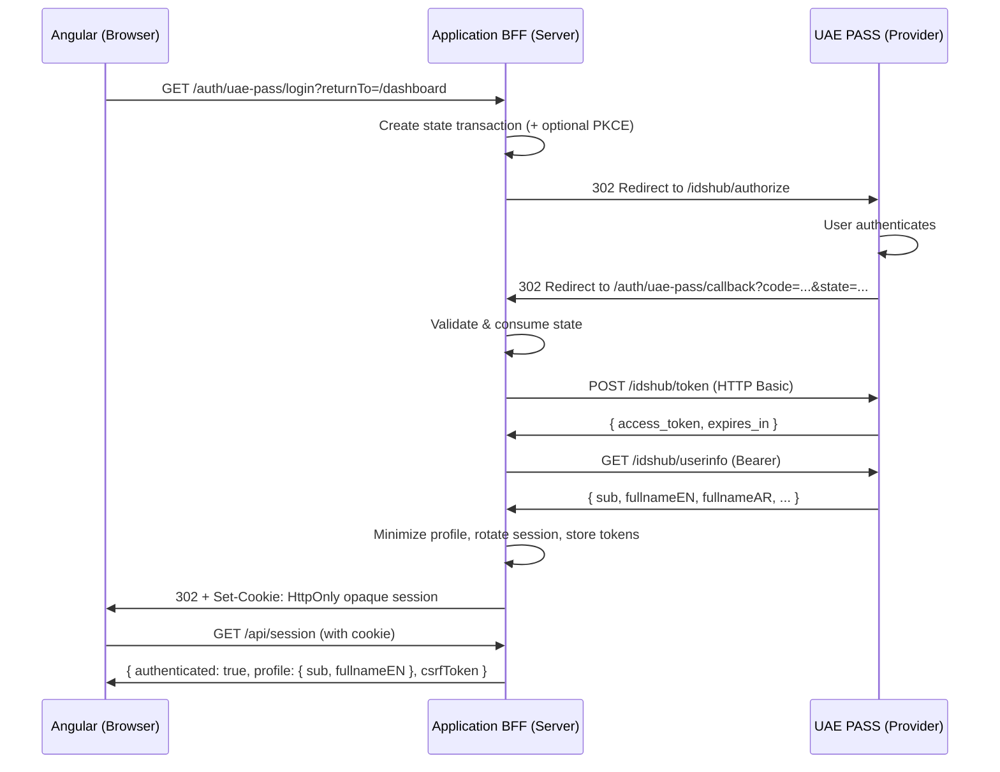
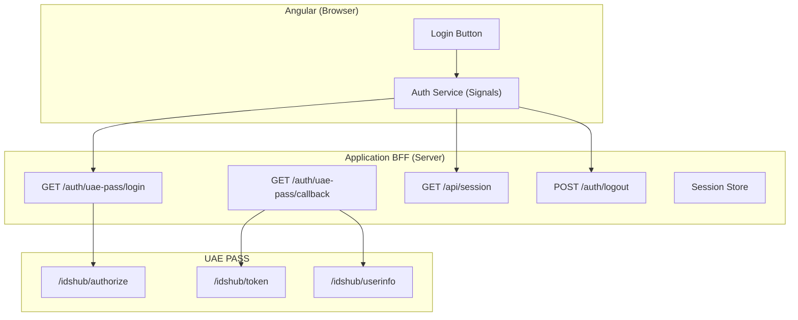

# 🥋 Sensei UAE PASS Documentation

`sensei-uaepass` is a BFF-first Angular session client for [UAE PASS](https://uaepass.ae) integrations.
The Angular package handles session UI and state using **Angular Signals**; your Backend-for-Frontend owns
OAuth transactions, tokens, identity validation, and logout.

> ⚠️ This community package is designed with reference to published UAE PASS
> documentation. It is **not** certified, approved, or endorsed by UAE PASS. Each
> service provider must complete its own onboarding and security approval.

## How It Works

## Architecture Overview

The browser never receives UAE PASS access, refresh, or ID tokens.

## Key Features

- **BFF-first security** — all OAuth transactions are server-owned
- **Angular Signals** — reactive session state with `status()`, `profile()`, `isAuthenticated()`
- **Standalone components** — modern Angular architecture, no NgModules
- **Arabic & RTL support** — built-in localization with `ui_locales` forwarding
- **CSRF-protected logout** — origin allowlist + in-memory CSRF token
- **Session rotation** — new opaque session ID on every successful login
- **Data minimization** — BFF returns only `sub`, `fullnameEN`, `fullnameAR` by default
- **Production-ready** — shared session store requirement, rate limiting, health checks

## Get Started

| Step | Page |
| --- | --- |
| 1. Install the package | [Installation](getting-started/installation.md) |
| 2. Configure Angular | [Quickstart](getting-started/quickstart.md) |
| 3. Understand the BFF | [BFF Architecture](security/bff-architecture.md) |
| 4. Check compatibility | [Angular Compatibility](getting-started/compatibility.md) |
| 5. Migrate from v2 | [Migration to v3](getting-started/migration-v3.md) |

## Explore

- [Configuration Reference](configuration/uaepass-config.md)
- [Login Button Component](components/login-button.md)
- [Authentication Service](services/auth-service.md)
- [UAE PASS Web Contract](security/uae-pass-contract.md)
- [Threat Model](security/threat-model.md)
- [Production Checklist](deployment/production-checklist.md)
- [Node.js/Express BFF Example](examples/node-bff.md)
- [Angular Demo](examples/angular-demo.md)
