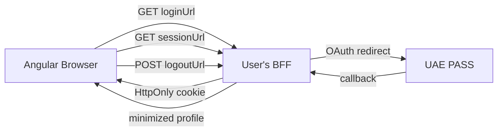

# AI Agent Guide

> This file is written for AI coding assistants (GitHub Copilot, Cursor, Cascade,
> Claude, etc.) that need to understand and integrate `sensei-uaepass` into an
> Angular application — regardless of what backend the user is running.

## TL;DR for AI Agents

`sensei-uaepass` is an **Angular library** (not a backend). It provides:
- A login button component (`UaePassLoginButtonComponent`)
- An auth service with signals (`UaePassAuthService`)
- A config provider (`provideUaePass`)

It does **NOT** handle OAuth itself. It expects **3 BFF endpoints** to exist on the
user's backend. Your job is to wire up the Angular side and ensure the backend
implements the correct contract.

---

## Package Identity

| Field | Value |
| --- | --- |
| npm package | `sensei-uaepass` |
| Angular peer | `>=19.2.0 <21.0.0` |
| RxJS peer | `7.8.x` |
| Node.js (for BFF) | `>=22.12` |
| License | MIT |
| Framework | Angular Signals + Standalone Components |

## Architecture in One Diagram



**Key rule:** The browser never sees UAE PASS tokens. The BFF owns all OAuth.

---

## Angular Public API (Complete)

### Imports

```ts
import {
  provideUaePass,
  UaePassAuthService,
  UaePassLoginButtonComponent,
  UaePassAuthStatus,
  UaePassLanguageCode,
  UaePassErrorCode,
  UaePassError,
  type UaePassConfig,
  type UaePassUserProfile,
  type UaePassSessionResponse,
} from 'sensei-uaepass';
```

### `provideUaePass(config: UaePassConfig): Provider[]`

Call in `app.config.ts` providers array. Validates and freezes config.

```ts
provideUaePass({
  loginUrl: '/auth/uae-pass/login',    // BFF endpoint — required
  sessionUrl: '/api/session',          // BFF endpoint — required
  logoutUrl: '/auth/logout',           // BFF endpoint — required
  language: 'en',                      // 'en' | 'ar' — optional, default 'en'
  requestTimeoutMs: 20000,             // optional, default 20000
  autoRestoreSession: true,            // optional, default true
  buttonLogos: {                       // optional
    english: '/assets/uaepass-en.svg',
    arabic: '/assets/uaepass-ar.svg',
  },
})
```

**Validation rules:**
- `loginUrl`, `sessionUrl`, `logoutUrl` are required, must be non-empty
- `javascript:` URLs are rejected
- `language` must be `'en'` or `'ar'`
- `requestTimeoutMs` must be positive finite number
- Config is frozen with `Object.freeze()`

### `UaePassAuthService` (providedIn: 'root')

#### Signals

| Signal | Type | Description |
| --- | --- | --- |
| `status()` | `UaePassAuthStatus` | Current lifecycle state |
| `profile()` | `UaePassUserProfile \| null` | Minimized identity from BFF |
| `isAuthenticated()` | `boolean` | `true` only when status is `Authenticated` AND profile has valid `sub` |
| `error()` | `string \| null` | Human-readable error message |
| `errorCode()` | `UaePassErrorCode \| null` | Typed error code |

#### Methods

| Method | Returns | Description |
| --- | --- | --- |
| `login(returnPath?: string)` | `void` | Redirects browser to `loginUrl` with `returnTo` and `ui_locales` query params |
| `restoreSession()` | `Promise<boolean>` | GETs `sessionUrl` with credentials; auto-called on init if `autoRestoreSession !== false` |
| `logout()` | `Promise<void>` | POSTs to `logoutUrl` with `X-CSRF-Token` header; navigates to `redirectUrl` from response |
| `resetError()` | `void` | Clears `error()` and `errorCode()` signals |

#### `login()` details

Builds URL: `{loginUrl}?returnTo={path}&ui_locales={en|ar}`

- `returnTo` defaults to current path (`window.location.pathname + search + hash`)
- `returnPath` argument is validated: must start with `/`, must not start with `//`, must not contain `\`
- Falls back to `/` if invalid
- Uses `window.location.assign()` to navigate

#### `restoreSession()` details

- Sends `GET {sessionUrl}` with `withCredentials: true`
- Timeout: `requestTimeoutMs` (default 20s)
- Validates response shape (see BFF contract below)
- On success: sets `profile`, `csrfToken`, status = `Authenticated`
- On no session: status = `Idle`, profile = `null`
- On failure: status = `Error`, sets error + errorCode

#### `logout()` details

- Sends `POST {logoutUrl}` with `withCredentials: true`
- Includes `X-CSRF-Token` header from the session response
- Expects response: `{ loggedOut: boolean, redirectUrl: string }`
- On success: clears state, navigates to `redirectUrl` (UAE PASS logout URL)
- On failure: status = `Error`

### `UaePassLoginButtonComponent`

**Selector:** `uae-pass-login-button`

| Input | Type | Default | Description |
| --- | --- | --- | --- |
| `language` | `'en' \| 'ar'` | Config language or `'en'` | Button text + logo language |
| `customImageSrc` | `string \| null` | `null` | Override button image |
| `customStyles` | `string` | `''` | Inline styles on image |
| `isDisabled` | `boolean` | `false` | Manual disable |

| Output | Type | Description |
| --- | --- | --- |
| `pressed` | `void` | Emitted before `auth.login()` is called |

**Auto-disabled** when status is `Authorizing`, `LoadingSession`, or `LoggingOut`.

### Enums

```ts
enum UaePassAuthStatus {
  Idle = 'idle',
  LoadingSession = 'loadingSession',
  Authorizing = 'authorizing',
  Authenticated = 'authenticated',
  LoggingOut = 'loggingOut',
  Error = 'error',
  LoggedOut = 'loggedOut',
}

enum UaePassLanguageCode {
  En = 'en',
  Ar = 'ar',
}

enum UaePassErrorCode {
  InvalidConfiguration = 'invalid_configuration',
  RedirectUnavailable = 'redirect_unavailable',
  SessionFetchFailed = 'session_fetch_failed',
  InvalidSessionResponse = 'invalid_session_response',
  AuthorizationFailed = 'authorization_failed',
  LogoutFailed = 'logout_failed',
}
```

### Types

```ts
interface UaePassUserProfile {
  sub: string;              // required — stable user ID
  fullnameEN?: string;
  fullnameAR?: string;
  email?: string;
  userType?: string;
  [key: string]: unknown;   // extensible
}

interface UaePassSessionResponse {
  authenticated: boolean;
  profile?: UaePassUserProfile | null;
  csrfToken?: string;
}

interface UaePassConfig {
  loginUrl: string;
  sessionUrl: string;
  logoutUrl: string;
  language?: 'en' | 'ar';
  requestTimeoutMs?: number;
  autoRestoreSession?: boolean;
  buttonLogos?: { english?: string; arabic?: string };
}
```

### Error class

```ts
class UaePassError extends Error {
  readonly name = 'UaePassError';
  readonly code: UaePassErrorCode;
  readonly originalError?: unknown;
}
```

---

## BFF Contract (Backend-agnostic)

The Angular library expects **exactly 3 endpoints** on the user's backend. The
reference implementation is Node.js/Express, but **any backend works** if it
implements this contract.

### Endpoint 1: `GET {loginUrl}`

**Query params received from Angular:**
- `returnTo` — local path to return to after login (e.g. `/dashboard`)
- `ui_locales` — `en` or `ar`

**What the BFF must do:**
1. Generate random `state` string
2. Optionally generate PKCE verifier + S256 challenge (if enabled)
3. Store transaction: `{ state, verifier?, returnTo, createdAt }` in server session
4. Set a session cookie (opaque, HttpOnly)
5. Redirect (302) to UAE PASS `/idshub/authorize` with:
   - `response_type=code`
   - `client_id`, `redirect_uri`, `scope`, `state`
   - `code_challenge` + `code_challenge_method=S256` (if PKCE enabled)
   - `acr_values`, `ui_locales`

**If user already has a valid session:** redirect directly to `returnTo`.

### Endpoint 2: `GET {loginUrl}/callback` (or wherever registered)

**Query params from UAE PASS:**
- `code` — authorization code
- `state` — must match stored transaction

**Or on cancellation:**
- `error` — error code

**What the BFF must do:**
1. Read session cookie → get stored transaction
2. Validate `state` matches, not expired (5 min), not already consumed
3. Delete transaction (one-time-use)
4. If `error` param present → redirect to `/?auth=cancelled`
5. Exchange code: `POST /idshub/token` with HTTP Basic auth
6. Fetch user info: `GET /idshub/userinfo` with Bearer token
7. Minimize profile (keep only `sub`, `fullnameEN`, `fullnameAR`)
8. Generate new session ID (rotation)
9. Store: `{ authenticated: true, profile, csrfToken, tokens, tokenExpiresAt }`
10. Delete old session, set new cookie
11. Redirect (302) to `returnTo`

### Endpoint 3: `GET {sessionUrl}`

**Request:** GET with session cookie, `Origin` header

**What the BFF must do:**
1. Read session cookie → get session from store
2. Check `tokenExpiresAt` > now
3. If no session or expired → delete session, clear cookie, return:
   ```json
   { "authenticated": false, "profile": null }
   ```
4. If valid → return:
   ```json
   {
     "authenticated": true,
     "profile": { "sub": "...", "fullnameEN": "...", "fullnameAR": "..." },
     "csrfToken": "..."
   }
   ```

**CORS:** Must return `Access-Control-Allow-Origin: {exact origin}` and
`Access-Control-Allow-Credentials: true`. Never use `*` with credentials.

**Angular validates the response:**
- `authenticated` must be `boolean`
- If `authenticated === true`: `profile.sub` must be non-empty string, `csrfToken` must be non-empty string
- If `authenticated === false`: `profile` must be `null` or `undefined`
- If validation fails → `errorCode = 'invalid_session_response'`

### Endpoint 4: `POST {logoutUrl}`

**Request:** POST with session cookie, `X-CSRF-Token` header, `Origin` header

**What the BFF must do:**
1. Validate `Origin` is in allowlist → else `403 { error: "origin_rejected" }`
2. Validate `X-CSRF-Token` matches session → else `403 { error: "csrf_rejected" }`
3. Delete session from store
4. Clear session cookie
5. Build UAE PASS logout URL: `{logoutUrl}?redirect_uri={registered logout redirect}`
6. Return:
   ```json
   { "loggedOut": true, "redirectUrl": "https://stg-id.uaepass.ae/idshub/logout?redirect_uri=..." }
   ```

**Angular then calls `window.location.assign(redirectUrl)`** to end the UAE PASS
provider session.

---

## UAE PASS Provider Reference

| Environment | Base URL |
| --- | --- |
| Staging | `https://stg-id.uaepass.ae` |
| Production | `https://id.uaepass.ae` |

| Endpoint | Method | Path |
| --- | --- | --- |
| Authorize | `GET` | `/idshub/authorize` |
| Token | `POST` | `/idshub/token` |
| User info | `GET` | `/idshub/userinfo` |
| Logout | `GET` | `/idshub/logout` |

**Token endpoint specifics:**
- Client auth: HTTP Basic (`client_id:client_secret` base64)
- Params in query string: `grant_type=authorization_code`, `code`, `redirect_uri`
- Content-Type: `multipart/form-data; charset=UTF-8`
- If PKCE: add `code_verifier` to query

**User info endpoint specifics:**
- Auth: `Bearer {access_token}`
- Content-Type: `application/x-www-form-urlencoded`

---

## Common Integration Patterns

### Pattern 1: Route guard

```ts
import { inject } from '@angular/core';
import { CanActivateFn } from '@angular/router';
import { UaePassAuthService } from 'sensei-uaepass';

export const authGuard: CanActivateFn = async () => {
  const auth = inject(UaePassAuthService);
  if (auth.isAuthenticated()) return true;
  await auth.restoreSession();
  if (auth.isAuthenticated()) return true;
  auth.login();
  return false;
};
```

### Pattern 2: Conditional UI

```ts
@Component({
  template: `
    @if (auth.status() === AuthStatus.LoadingSession) {
      <app-spinner />
    } @else if (auth.isAuthenticated()) {
      <app-dashboard />
    } @else {
      <uae-pass-login-button />
    }
  `,
})
export class AppComponent {
  readonly auth = inject(UaePassAuthService);
  readonly AuthStatus = UaePassAuthStatus;
}
```

### Pattern 3: Error display + retry

```ts
@Component({
  template: `
    @if (auth.error(); as err) {
      <div role="alert">
        {{ auth.errorCode() }}: {{ err }}
        <button (click)="retry()">Retry</button>
        <button (click)="auth.resetError()">Dismiss</button>
      </div>
    }
  `,
})
export class ErrorComponent {
  readonly auth = inject(UaePassAuthService);

  retry() {
    if (this.auth.errorCode() === UaePassErrorCode.SessionFetchFailed) {
      void this.auth.restoreSession();
    } else if (this.auth.errorCode() === UaePassErrorCode.LogoutFailed) {
      void this.auth.logout();
    } else {
      this.auth.login();
    }
  }
}
```

### Pattern 4: Arabic RTL app

```ts
provideUaePass({
  loginUrl: '/auth/uae-pass/login',
  sessionUrl: '/api/session',
  logoutUrl: '/auth/logout',
  language: 'ar',
});
```

```html
<!-- index.html -->
<html dir="rtl" lang="ar">
```

---

## Gotchas for AI Agents

1. **No callback route in Angular.** The OAuth callback goes to the BFF, not Angular.
   Do not create an Angular route for `/auth/uae-pass/callback`.

2. **`withCredentials: true` is built-in.** The library already sends credentials
   with session/logout requests. The BFF must support credentialed CORS.

3. **`autoRestoreSession` defaults to `true`.** The service calls `restoreSession()`
   in its constructor. If you call it again in a guard, that's fine — it's idempotent.

4. **`isAuthenticated()` is a computed signal.** It's `true` only when
   `status() === 'authenticated'` AND `profile()?.sub` is a non-empty string.
   Don't check `status() === 'authenticated'` alone.

5. **Logout navigates away.** `auth.logout()` calls `window.location.assign()`
   with the UAE PASS logout URL from the BFF response. The page will navigate.

6. **`login()` navigates away.** `auth.login()` calls `window.location.assign()`.
   The Angular app unloads. Don't expect to handle a "return" — the BFF redirects
   back after OAuth completes.

7. **No tokens in Angular.** Do not look for `access_token`, `id_token`, or
   `refresh_token` anywhere in the Angular code. They don't exist in the public API.

8. **Config is frozen.** `provideUaePass` calls `Object.freeze()`. Don't try to
   mutate config at runtime.

9. **`returnPath` is validated.** Must start with `/`, must not start with `//`,
   must not contain `\`. Falls back to `/` if invalid.

10. **Session response validation is strict.** If `authenticated: true` but
    `profile.sub` is empty or `csrfToken` is missing, the library rejects it with
    `invalid_session_response`.

---

## Backend Implementation Checklist (Any Language)

When the user has a non-Node.js backend, ensure it implements:

- [ ] `GET /auth/uae-pass/login` — creates state, stores in session, redirects to UAE PASS
- [ ] `GET /auth/uae-pass/callback` — validates state, exchanges code, fetches user info, minimizes profile, rotates session, redirects to Angular
- [ ] `GET /api/session` — returns `{ authenticated, profile, csrfToken }` or `{ authenticated: false, profile: null }`
- [ ] `POST /auth/logout` — validates origin + CSRF, deletes session, returns `{ loggedOut, redirectUrl }`
- [ ] Opaque HttpOnly session cookie (not JWT)
- [ ] Session rotation on login (new cookie value)
- [ ] CSRF token stored server-side, returned in session response
- [ ] Origin allowlist (exact match, no wildcards with credentials)
- [ ] Credentialed CORS headers
- [ ] Token expiry check on every session read
- [ ] No tokens in any response sent to the browser
- [ ] Rate limiting on auth endpoints

---

## Quick Reference: What Goes Where

| Concern | Lives in Angular | Lives in BFF |
| --- | --- | --- |
| Login button UI | ✅ | ❌ |
| Session state signals | ✅ | ❌ |
| OAuth state generation | ❌ | ✅ |
| PKCE verifier | ❌ | ✅ |
| Authorization code | ❌ | ✅ |
| Access/refresh/ID tokens | ❌ | ✅ |
| Client secret | ❌ | ✅ |
| UAE PASS API calls | ❌ | ✅ |
| Profile minimization | ❌ | ✅ |
| Session cookie | Read-only | ✅ (set/clear) |
| CSRF token | Sent in header | ✅ (generate/validate) |
| Redirect URI | ❌ | ✅ (fixed, server-owned) |
| `returnTo` path | ✅ (sent as query param) | ✅ (validated, used for redirect) |

---

## Agent Instructions: Follow the User's Project Patterns

Before writing any code, **always** inspect the user's existing project and adapt to
their conventions. Do not impose a different style. The library is flexible — the
BFF contract is language-agnostic.

### Step 0: Inspect the project before writing code

Run these checks before generating any integration code:

1. **Read the existing `package.json`** — confirm Angular version, check if
   `@angular/common/http` is already used, check the package manager (npm, yarn, pnpm).

2. **Read the app config file** — find where providers are registered. Common names:
   - `app.config.ts`, `app.module.ts`, `main.ts`
   - Look for existing `provideHttpClient`, `provideRouter`, or `imports: [HttpClientModule]`

3. **Read the routing setup** — find where routes are defined. Note the route structure,
   lazy-loading patterns, and any existing guards.

4. **Read existing components** — note the patterns used:
   - Standalone components vs NgModule-based
   - Template style (inline `template:` vs `templateUrl`)
   - Style approach (inline `styles:`, `styleUrls`, Tailwind, SCSS, CSS modules)
   - Signal-based state vs RxJS subscriptions
   - `inject()` vs constructor injection

5. **Read the backend code** — identify the language, framework, and patterns:
   - Express, Fastify, NestJS, Django, FastAPI, Spring Boot, .NET, Go, etc.
   - How sessions/cookies are currently handled
   - How environment variables are loaded
   - Existing middleware patterns (CORS, rate limiting, logging)
   - Existing auth/session infrastructure

### Match the user's conventions

| Concern | What to look for | How to adapt |
| --- | --- | --- |
| **Injection** | `inject()` vs `constructor(private x: X)` | Use whichever the project already uses |
| **Components** | `standalone: true` vs NgModule `declarations` | If NgModule-based, add to `declarations` and `imports` |
| **Templates** | Inline `template:` vs separate `.html` files | Match the existing pattern |
| **Styles** | Inline `styles:` vs `.scss`/`.css` files | Match the existing pattern |
| **State** | Signals vs BehaviorSubject/observables | The library uses Signals; if the project uses RxJS, wrap with `toSignal()` or read signals directly |
| **Config** | `app.config.ts` (standalone) vs `AppModule` | Add `provideUaePass()` to the right place |
| **HTTP** | `provideHttpClient()` vs `HttpClientModule` | If NgModule-based, import `HttpClientModule` instead |
| **Backend** | Any language/framework | Implement the 4 BFF endpoints in the user's backend language using their existing patterns |
| **Env vars** | `.env`, `config.ts`, `settings.py`, `application.yml` | Add UAE PASS config to whatever the project already uses |
| **Session store** | Redis, database, in-memory | Use whatever session infrastructure the project already has |
| **CORS** | Existing CORS middleware | Add the Angular origin to the existing allowlist, don't create a separate middleware |
| **Logging** | Existing logger (winston, pino, log4j, etc.) | Use the project's logger, don't introduce a new one |
| **Error handling** | Existing error-handling middleware | Return errors in the format the project already uses, but include `correlationId` |

### Backend adaptation examples

#### If the user has a Python/FastAPI backend

```python
# Don't create a new file structure — add to their existing app
@app.get("/auth/uae-pass/login")
async def uae_pass_login(request: Request, returnTo: str = "/", ui_locales: str = "en"):
    # Use their existing session mechanism
    # Use their existing HTTP client (httpx, requests, aiohttp)
    # Use their existing env config (pydantic Settings, os.environ, etc.)
    ...
```

#### If the user has a Java/Spring Boot backend

```java
// Add to their existing @RestController
@RestController
@RequestMapping("/auth/uae-pass")
public class UaePassController {

    // Inject their existing ObjectMapper, RestTemplate, session repo, etc.
    @GetMapping("/login")
    public void login(@RequestParam String returnTo,
                      @RequestParam String ui_locales,
                      HttpServletResponse response) {
        // Use their existing session/cookie mechanism
        ...
    }
}
```

#### If the user has a .NET backend

```csharp
// Add to their existing controller
[ApiController]
[Route("auth/uae-pass")]
public class UaePassController : ControllerBase {

    // Inject their existing services
    [HttpGet("login")]
    public IActionResult Login([FromQuery] string returnTo, [FromQuery] string ui_locales) {
        // Use their existing cookie auth, IDistributedCache, etc.
        ...
    }
}
```

### Rules for AI agents

1. **Never create unnecessary files.** Add endpoints to existing controllers, routes,
   or files. Don't create a new directory structure unless the user's project clearly
   separates by feature.

2. **Never introduce new dependencies.** Use the HTTP client, session store, logger,
   and validation library the project already has. If the project uses `axios`, don't
   add `node-fetch`. If the project uses `joi`, don't add `zod`.

3. **Never change the project's folder structure.** Place new files where the project
   would naturally place them (e.g. next to existing controllers, in the existing
   routes folder, etc.).

4. **Match naming conventions.** If the project uses `camelCase` for files, don't
   create `uae-pass-controller.js` — create `uaePassController.js`. If the project uses
   `kebab-case`, do the opposite.

5. **Match the project's HTTP client.** If the backend uses `fetch`, use `fetch`. If
   it uses `axios`, use `axios`. If it uses `RestTemplate`, use `RestTemplate`.

6. **Match the project's session/cookie approach.** If the project already has session
   middleware (e.g. `express-session`, Django sessions, ASP.NET cookies), extend it.
   Don't create a parallel session system.

7. **Match the project's env config.** If the project uses `.env` files, add vars
   there. If it uses `pydantic Settings`, add fields there. If it uses Spring
   `application.yml`, add properties there.

8. **Ask before breaking patterns.** If the library requires something that conflicts
   with the project's conventions (e.g. the project uses JWT cookies but the library
   needs opaque cookies), explain the conflict and ask the user before proceeding.

9. **Keep changes minimal.** The Angular side should be 3-4 files at most:
   - App config (add `provideUaePass`)
   - Login component (add `<uae-pass-login-button>`)
   - Dashboard/guard component (read session state)
   - Optionally: error component

10. **Test what you can.** After wiring up, verify:
    - Angular compiles (`ng build` or `npm run build`)
    - BFF endpoints respond (curl the health check)
    - Session flow works (click login, verify redirect, verify callback)
    - Logout works (click logout, verify redirect to UAE PASS logout)
