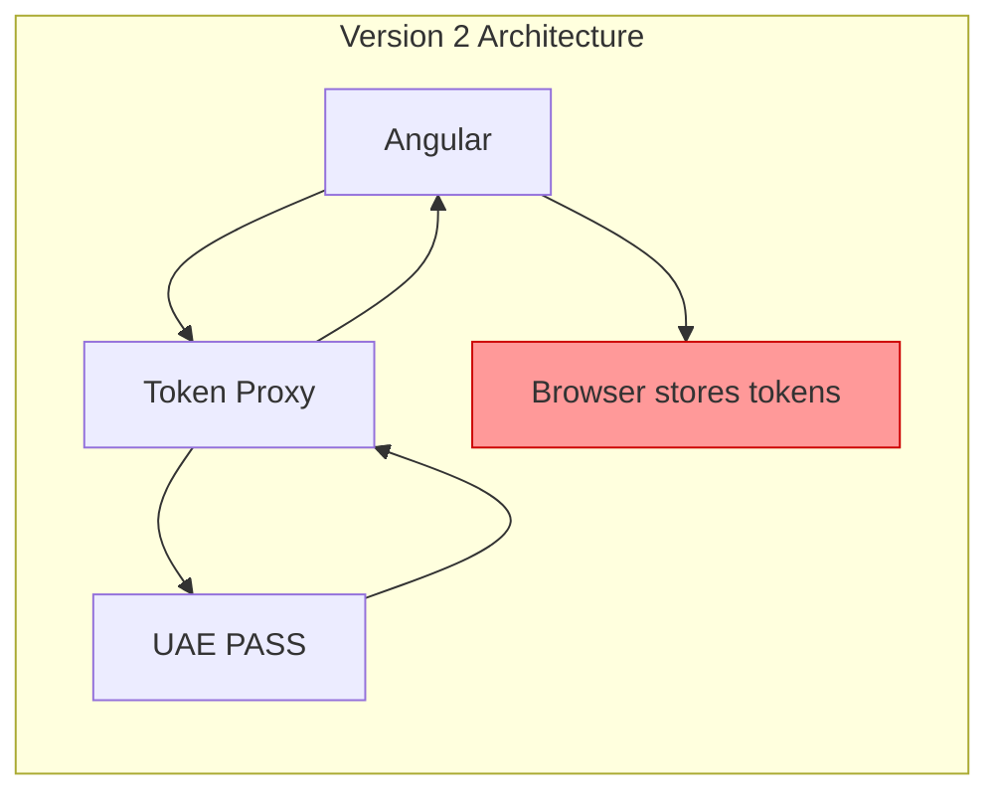
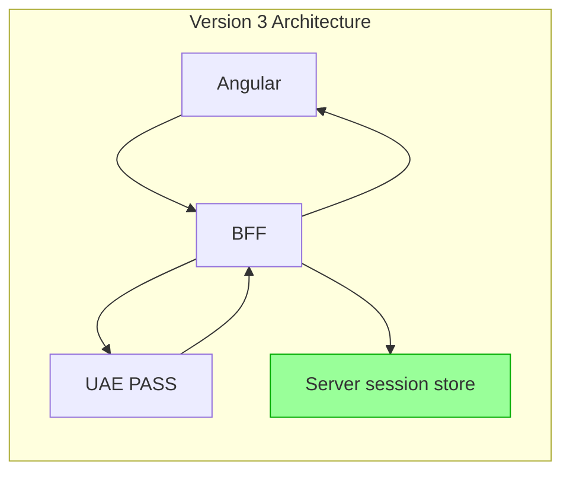

# ADR 001: BFF Security Boundary

**Status:** Accepted

**Date:** July 29, 2026

## Context

Version 2 used a token-mediating backend. Angular supplied the code, redirect URI,
and PKCE verifier, then received and stored the token response and profile. This left
provider tokens exposed to browser JavaScript and did not bind the OAuth transaction
to a server session.

**Problem:** Tokens in browser storage are accessible to XSS attacks.

## Decision

Version 3 makes the application BFF the OAuth boundary. The BFF owns login
initiation, state, PKCE, callback handling, token exchange, user-info retrieval,
identity validation, session rotation, token storage, and logout.

Angular receives only an opaque application cookie and a minimized session response.

**Improvement:** Tokens never enter browser-visible state.

## Consequences

| Positive | Negative |
| --- | --- |
| XSS cannot directly read provider tokens | The public Angular API is smaller and no longer exposes tokens |
| Session is bound to a server transaction | Version 3 is a breaking release |
| Logout is server-controlled with CSRF protection | Applications must operate a stateful BFF |
| Profile data is minimized by the BFF | Production requires a shared session store |
| Logs contain no tokens or identity payloads | Provider contract verification becomes an explicit release gate |

XSS can still act through the current application session while malicious code executes,
but it cannot exfiltrate provider tokens.
