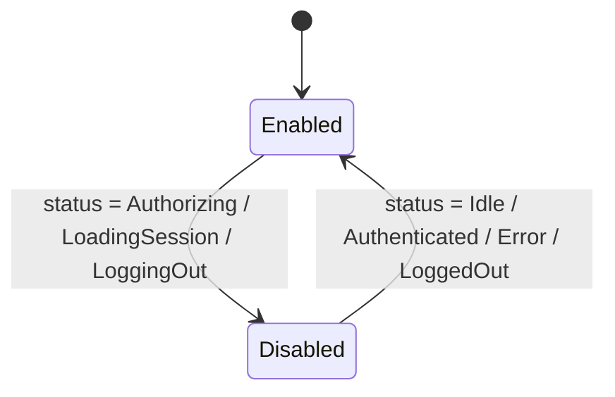

# Login Button

`UaePassLoginButtonComponent` is a standalone, accessible, localized UAE PASS button
with hover/active animations and a loading spinner.

**Selector:** `uae-pass-login-button`

## Basic usage

```ts
import { Component } from '@angular/core';
import { UaePassLoginButtonComponent } from 'sensei-uaepass';

@Component({
  standalone: true,
  imports: [UaePassLoginButtonComponent],
  template: `<uae-pass-login-button />`,
})
export class LoginComponent {}
```

## With explicit language

```html
<uae-pass-login-button language="ar" />
```

## With custom image and styles

```html
<uae-pass-login-button
  language="en"
  customImageSrc="/assets/my-uaepass-btn.png"
  customStyles="max-width: 300px; border-radius: 8px;"
  [isDisabled]="someCondition"
  (pressed)="onButtonPressed()"
/>
```

## Inputs

| Input | Type | Default | Description |
| --- | --- | --- | --- |
| `language` | `'en' \| 'ar'` | Config `language` or `'en'` | Button language and logo |
| `customImageSrc` | `string \| null` | `null` | Override the button image |
| `customStyles` | `string` | `''` | Inline styles applied to the image element |
| `isDisabled` | `boolean` | `false` | Manually disable the button |

## Outputs

| Output | Type | Description |
| --- | --- | --- |
| `pressed` | `void` | Emitted before `auth.login()` is called |

## Behavior

Clicking the button:

1. Emits the `pressed` output
2. Calls `UaePassAuthService.login()` (redirects browser to BFF)

The button is **automatically disabled** while the service is in one of these states:

- `Authorizing` — login redirect in progress
- `LoadingSession` — session restoration in progress
- `LoggingOut` — logout in progress



## Styling

The component uses `ChangeDetectionStrategy.OnPush` and includes built-in styles:

- Hover: image lifts 2px with drop shadow
- Active: image presses down with reduced shadow
- Disabled: 60% opacity, `not-allowed` cursor
- Loading: spinner overlay with blue border-top
- Mobile: image max-width 280px, centered

### Host class

The host element receives the class `uaepass-login-button`:

```css
uaepass-login-button {
  display: block;
  width: 100%;
}
```

## Accessibility

- `aria-label` is set to the localized "Sign in with UAE PASS" text
- `alt` text on the image matches the `aria-label`
- Button type is `button` (not `submit`)
