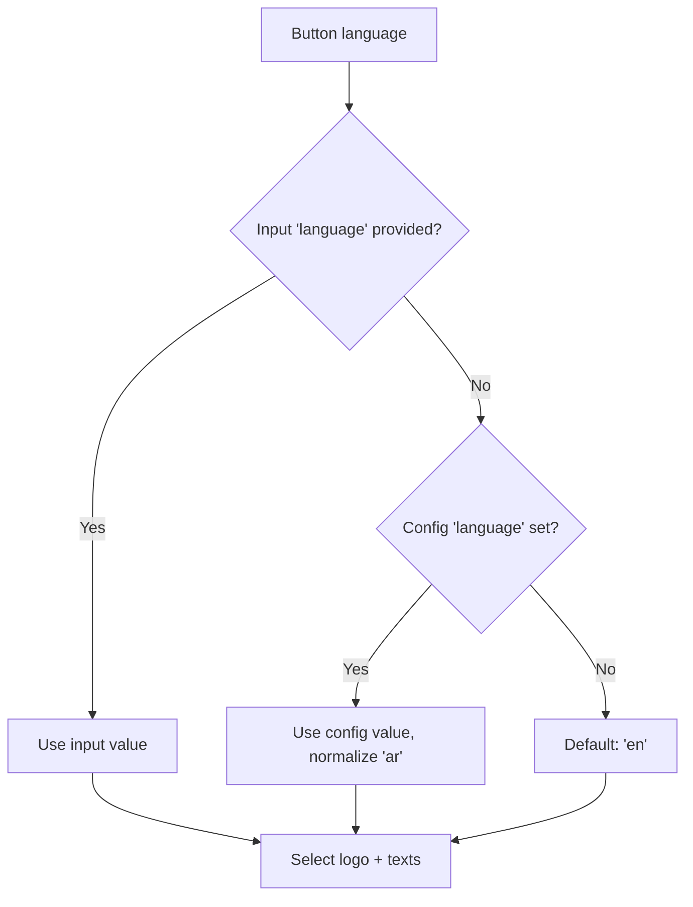
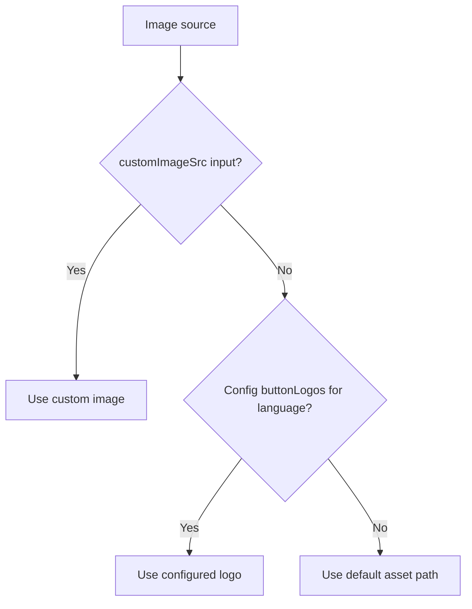

# Language & Logos

## Language resolution

`UaePassLoginButtonComponent` resolves language in priority order:



| Priority | Source | Example |
| --- | --- | --- |
| 1 | Component input `language` | `<uae-pass-login-button language="ar" />` |
| 2 | `UaePassConfig.language` | `provideUaePass({ language: 'ar' })` |
| 3 | Default | `'en'` |

The service sends `ui_locales=en` or `ui_locales=ar` to the BFF login endpoint. The
BFF validates it and includes it in the UAE PASS authorization URL.

## Localized texts

| Language | Button text |
| --- | --- |
| English | "Sign in with UAE PASS" |
| Arabic | "تسجيل الدخول بالهوية الرقمية" |

## Logos

### Default assets

The package ships with default UAE PASS button asset paths:

- English: `assets/UAEPASS_Sign_with_Btn_Outline_Active@2x.svg`
- Arabic: `assets/UAEPASS_Sign_with_Btn_Outline_Active_AR@2x.svg`

Place these SVG files in your application's `src/assets/` directory.

### Custom logos

Override the default button images via config:

```ts
provideUaePass({
  // ...endpoints...
  buttonLogos: {
    english: '/assets/uaepass-btn-en.svg',
    arabic: '/assets/uaepass-btn-ar.svg',
  },
});
```

### Per-component custom image

Override the image for a single button instance:

```html
<uae-pass-login-button customImageSrc="/assets/custom-uaepass-btn.png" />
```

### Logo resolution priority



## RTL support

For Arabic RTL layout, set `dir="rtl"` on your HTML element:

```html
<html dir="rtl" lang="ar">
```

The button component itself is language-aware and will display the Arabic logo and text
automatically when `language` is set to `'ar'`.
