# Configuration

`provideUaePass(config)` registers the `UAE_PASS_CONFIG` injection token with a frozen,
validated copy of your configuration.

## Configuration fields

| Field | Type | Required | Default | Purpose |
| --- | --- | --- | --- | --- |
| `loginUrl` | `string` | Yes | — | BFF endpoint that starts login |
| `sessionUrl` | `string` | Yes | — | BFF endpoint that returns the application session |
| `logoutUrl` | `string` | Yes | — | CSRF-protected BFF logout endpoint |
| `language` | `'en' \| 'ar'` | No | `'en'` | Login-button language |
| `requestTimeoutMs` | `number` | No | `20000` | Session and logout request timeout |
| `autoRestoreSession` | `boolean` | No | `true` | Restore the BFF session when the service starts |
| `buttonLogos.english` | `string` | No | Built-in | English button image path |
| `buttonLogos.arabic` | `string` | No | Built-in | Arabic button image path |

## Examples

### Minimal configuration

```ts
provideUaePass({
  loginUrl: '/auth/uae-pass/login',
  sessionUrl: '/api/session',
  logoutUrl: '/auth/logout',
});
```

### Full configuration

```ts
import { UaePassLanguageCode } from 'sensei-uaepass';

provideUaePass({
  loginUrl: 'https://bff.example.com/auth/uae-pass/login',
  sessionUrl: 'https://bff.example.com/api/session',
  logoutUrl: 'https://bff.example.com/auth/logout',
  language: UaePassLanguageCode.Ar,
  requestTimeoutMs: 10_000,
  autoRestoreSession: true,
  buttonLogos: {
    english: '/assets/UAEPASS_Sign_with_Btn_Outline_Active@2x.svg',
    arabic: '/assets/UAEPASS_Sign_with_Btn_Outline_Active_AR@2x.svg',
  },
});
```

### Disable auto session restore

If you want to control when session restoration happens (e.g. after a route guard):

```ts
provideUaePass({
  loginUrl: '/auth/uae-pass/login',
  sessionUrl: '/api/session',
  logoutUrl: '/auth/logout',
  autoRestoreSession: false,
});
```

Then call `restoreSession()` manually:

```ts
const auth = inject(UaePassAuthService);

// In a route guard or app initializer
const isAuthenticated = await auth.restoreSession();
if (!isAuthenticated) {
  // redirect to login
}
```

## Validation

Configuration is validated at startup by `validateUaePassConfig()`:

```mermaid
flowchart TD
    A[provideUaePass&#40;config&#41;] --> B{loginUrl present?}
    B -->|No| C["throw: loginUrl is required"]
    B -->|Yes| D{sessionUrl present?}
    D -->|No| E["throw: sessionUrl is required"]
    D -->|Yes| F{logoutUrl present?}
    F -->|No| G["throw: logoutUrl is required"]
    F -->|Yes| H{URLs use javascript:?}
    H -->|Yes| I["throw: must use HTTP(S) or relative URL"]
    H -->|No| J{language valid?}
    J -->|No| K["throw: language must be 'en' or 'ar'"]
    J -->|Yes| L{requestTimeoutMs valid?}
    L -->|No| M["throw: must be positive finite number"]
    L -->|Yes| N[Object.freeze&#40;config&#41;]
```



> UAE PASS client IDs, secrets, provider endpoints, scopes, redirect URIs, PKCE, and
> tokens are **BFF configuration** and must not appear in Angular configuration.

## Related

- [Language and Logos](language-and-logos.md)
- [Authentication Service](../services/auth-service.md)
- [Quickstart](../getting-started/quickstart.md)
