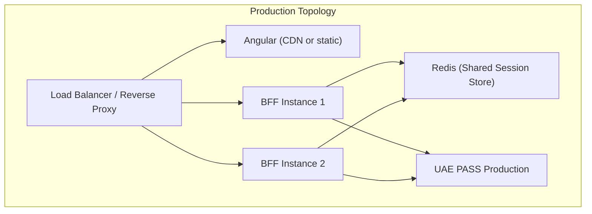

# Production Checklist

## UAE PASS onboarding

- [x] Match the published UAE PASS web endpoints and HTTP Basic token contract
- [ ] Complete UAE PASS onboarding and confirm client-specific scopes, login and
      logout redirect URIs, `acr_values`, profile attributes, and PKCE support
- [ ] Confirm the issued client ID and secret are in a managed secret store
- [ ] Test staging integration end-to-end before production

## Deployment topology

- [ ] Deploy Angular and the BFF behind HTTPS, preferably on one origin
- [ ] Use an exact origin allowlist; never combine credentialed CORS with `*`
- [ ] Use a shared, encrypted-at-rest session store with expiry and operational
      monitoring
- [ ] Configure `HttpOnly`, `Secure`, bounded-lifetime cookies and an intentional
      `SameSite` policy
- [ ] Validate reverse-proxy and trusted-proxy settings

## Secrets and session store

- [ ] Keep client secrets and session-store credentials in a managed secret store
- [ ] Test secret rotation and application-session invalidation
- [ ] Confirm `SESSION_STORE_MODULE` points to a production store (e.g. Redis)
- [ ] Verify session store has backup, failover, and monitoring

## OAuth transaction security

- [ ] Confirm state transactions are short-lived and one-time-use
- [ ] Enable S256 PKCE only when UAE PASS confirms support for the registered client
- [ ] Confirm callback, token, and user-info requests use bounded timeouts and sizes
- [ ] Verify the redirect URI is fixed and server-owned

## Data minimization

- [ ] Confirm `/api/session` returns only approved minimum profile fields
- [ ] Confirm logs contain no codes, tokens, cookies, Emirates IDs, or profile
      payloads
- [ ] Document each retained profile field's purpose, retention, and deletion process

## Testing

- [ ] Exercise login, cancellation, concurrent attempts, callback replay, session
      expiry, logout, provider failure, and store failure in staging
- [ ] Run the BFF integration test suite
- [ ] Test with both English and Arabic `ui_locales`

## Monitoring and CI/CD

- [ ] Separate liveness and readiness monitoring
- [ ] Enable branch protection, dependency review, CodeQL, secret scanning, and
      signed release tags
- [ ] Review the threat model and obtain independent security approval
