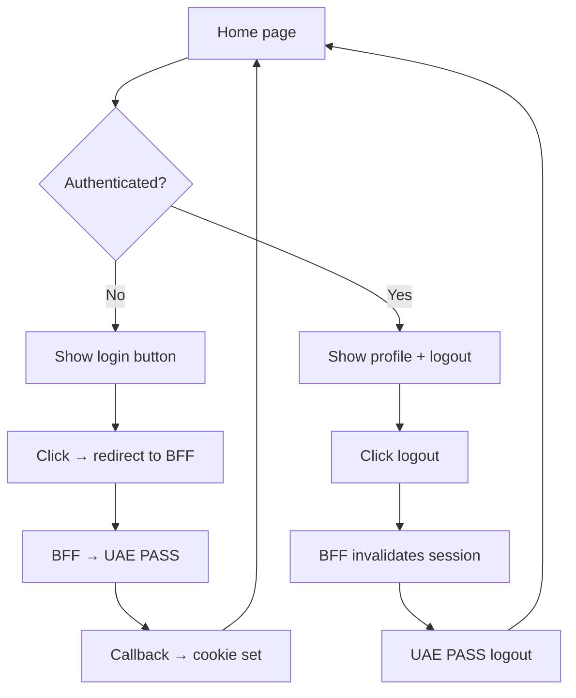

# Angular Demo

The demo application is in `projects/demo`. It demonstrates the full BFF-first flow
with the login button, session display, and logout.

## Run the demo

Run Angular and the BFF together:

```bash
npm run start:full
```

This starts:
- Angular dev server on `http://localhost:4200`
- BFF server on `http://localhost:3001`

### Prerequisites

Before starting, set the required BFF environment values documented in
`examples/bff/nodejs-express/.env.example`:

```bash
# PowerShell
$env:UAE_PASS_ENVIRONMENT='staging'
$env:UAE_PASS_CLIENT_ID='your-staging-client-id'
$env:UAE_PASS_CLIENT_SECRET='your-staging-client-secret'
$env:UAE_PASS_REDIRECT_URI='http://localhost:3001/auth/uae-pass/callback'
$env:UAE_PASS_LOGOUT_REDIRECT_URI='http://localhost:4200'
```

## Demo configuration

```ts
// projects/demo/src/app/app.config.ts
provideUaePass({
  loginUrl: 'http://localhost:3001/auth/uae-pass/login',
  sessionUrl: 'http://localhost:3001/api/session',
  logoutUrl: 'http://localhost:3001/auth/logout',
  language: UaePassLanguageCode.En,
  buttonLogos: {
    english: 'assets/UAEPASS_Sign_with_Btn_Outline_Active@2x.svg',
    arabic: 'assets/UAEPASS_Sign_with_Btn_Outline_Active_AR@2x.svg',
  },
});
```

## What the demo shows



- Restores an application session on page load
- Redirects login to the BFF
- Shows only a minimized display name (`fullnameEN`)
- Performs CSRF-protected logout
- Contains **no** OAuth callback route, token display, or browser token storage

## Demo component

```ts
// projects/demo/src/app/home/home.component.ts
@Component({
  standalone: true,
  imports: [UaePassLoginButtonComponent],
  templateUrl: './home.component.html',
  styleUrls: ['./home.component.scss'],
})
export class HomeComponent {
  private readonly auth = inject(UaePassAuthService);

  readonly status = this.auth.status;
  readonly profile = this.auth.profile;
  readonly error = this.auth.error;
  readonly isAuthenticated = this.auth.isAuthenticated;

  refreshSession(): void {
    void this.auth.restoreSession();
  }

  logout(): void {
    void this.auth.logout();
  }
}
```
