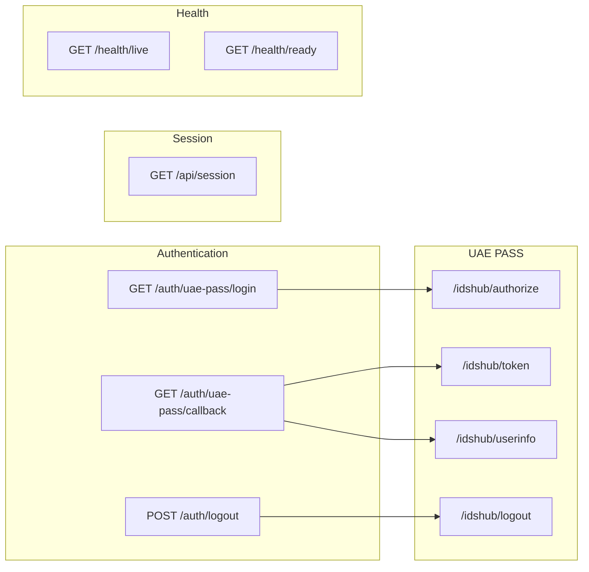

# BFF Endpoints Reference

Complete reference for all BFF endpoints in the Node.js/Express reference implementation.

## Endpoint overview



---

## `GET /auth/uae-pass/login`

Starts the OAuth login flow by redirecting to UAE PASS.

### Query parameters

| Parameter | Required | Default | Description |
| --- | --- | --- | --- |
| `returnTo` | No | `/` | Local path to return to after successful login |
| `ui_locales` | No | `en` | Language for UAE PASS login page (`en` or `ar`) |

### Response

- **Success:** `302` redirect to UAE PASS `/idshub/authorize`
- **No session cookie:** Creates a new transaction with a fresh session ID
- **Existing session:** Redirects to `returnTo` directly

### Example

```http
GET /auth/uae-pass/login?returnTo=/dashboard&ui_locales=en HTTP/1.1
Host: bff.example.com
```

```http
HTTP/1.1 302 Found
Location: https://stg-id.uaepass.ae/idshub/authorize?response_type=code&client_id=...&state=...&redirect_uri=...&scope=...&acr_values=...
Set-Cookie: uaepass_session=...; HttpOnly; Secure; SameSite=Lax; Path=/
```

### Rate limit

10 requests per 15 minutes per IP.

---

## `GET /auth/uae-pass/callback`

Receives the OAuth callback from UAE PASS, exchanges the code, fetches user info,
and creates the application session.

### Query parameters

| Parameter | Required | Description |
| --- | --- | --- |
| `code` | Yes | Authorization code from UAE PASS |
| `state` | Yes | State value matching the stored transaction |

### Error query parameters (UAE PASS cancellation)

| Parameter | Description |
| --- | --- |
| `error` | Error code from UAE PASS |
| `error_description` | Human-readable error description |

### Response

- **Success:** `302` redirect to `returnTo` with `Set-Cookie`
- **Invalid transaction:** `400` with `correlationId`
- **Upstream failure:** `502` with `correlationId`
- **Cancellation:** `302` redirect to `/?auth=cancelled`

### Example

```http
GET /auth/uae-pass/callback?code=abc123&state=xyz789 HTTP/1.1
Host: bff.example.com
Cookie: uaepass_session=...
```

```http
HTTP/1.1 302 Found
Location: /dashboard
Set-Cookie: uaepass_session=<new-id>; HttpOnly; Secure; SameSite=Lax; Path=/
```

### Rate limit

30 requests per 15 minutes per IP.

---

## `GET /api/session`

Returns the current application session state.

### Request

```http
GET /api/session HTTP/1.1
Host: bff.example.com
Cookie: uaepass_session=...
Origin: https://app.example.com
```

### Response (authenticated)

```json
{
  "authenticated": true,
  "profile": {
    "sub": "ae-uuid-12345",
    "fullnameEN": "Ahmed Al Mansoori",
    "fullnameAR": "أحمد المنصوري"
  },
  "csrfToken": "random-csrf-token"
}
```

### Response (not authenticated)

```json
{
  "authenticated": false,
  "profile": null
}
```

### CORS

- `Access-Control-Allow-Origin`: Exact origin from `ALLOWED_ORIGINS`
- `Access-Control-Allow-Credentials`: `true`
- `Vary`: `Origin`

### Rate limit

120 requests per 15 minutes per IP.

---

## `POST /auth/logout`

CSRF-protected session invalidation. Clears the application session and returns the
UAE PASS logout URL.

### Request

```http
POST /auth/logout HTTP/1.1
Host: bff.example.com
Cookie: uaepass_session=...
Origin: https://app.example.com
X-CSRF-Token: random-csrf-token
Content-Type: application/json
```

### Response (success)

```json
{
  "logoutUrl": "https://stg-id.uaepass.ae/idshub/logout?redirect_uri=https://app.example.com"
}
```

Also clears the session cookie:

```http
Set-Cookie: uaepass_session=; HttpOnly; Secure; SameSite=Lax; Path=; Max-Age=0
```

### Response (origin rejected)

```json
{
  "error": "origin_rejected",
  "correlationId": "uuid-here"
}
```

### Response (CSRF rejected)

```json
{
  "error": "csrf_rejected",
  "correlationId": "uuid-here"
}
```

### Rate limit

20 requests per 15 minutes per IP.

---

## `GET /health/live`

Liveness probe. Returns `200` if the process is running.

```http
HTTP/1.1 200 OK
Content-Type: application/json

{ "status": "ok" }
```

---

## `GET /health/ready`

Readiness probe. Returns `200` if the BFF can serve requests (session store is
connected, configuration is valid).

```http
HTTP/1.1 200 OK
Content-Type: application/json

{ "status": "ok", "sessionStore": "redis" }
```

If the session store is unavailable:

```http
HTTP/1.1 503 Service Unavailable
Content-Type: application/json

{ "status": "unavailable", "sessionStore": "redis" }
```

---

## Security headers on all responses

| Header | Value |
| --- | --- |
| `X-Content-Type-Options` | `nosniff` |
| `X-Frame-Options` | `DENY` |
| `Referrer-Policy` | `no-referrer` |
| `Cache-Control` | `no-store` |
| `Content-Security-Policy` | `default-src 'none'; frame-ancestors 'none'` |
| `Strict-Transport-Security` | `max-age=31536000; includeSubDomains` (production) |

## Related

- [BFF Architecture](../security/bff-architecture.md)
- [Node.js/Express BFF](node-bff.md)
- [UAE PASS Web Contract](../security/uae-pass-contract.md)
