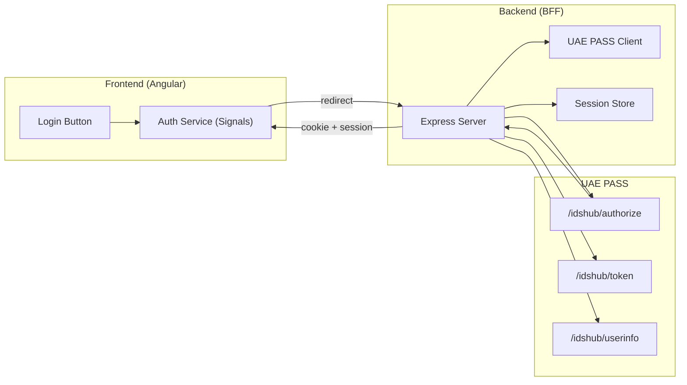
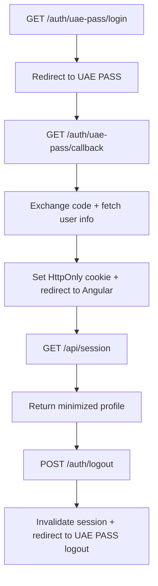
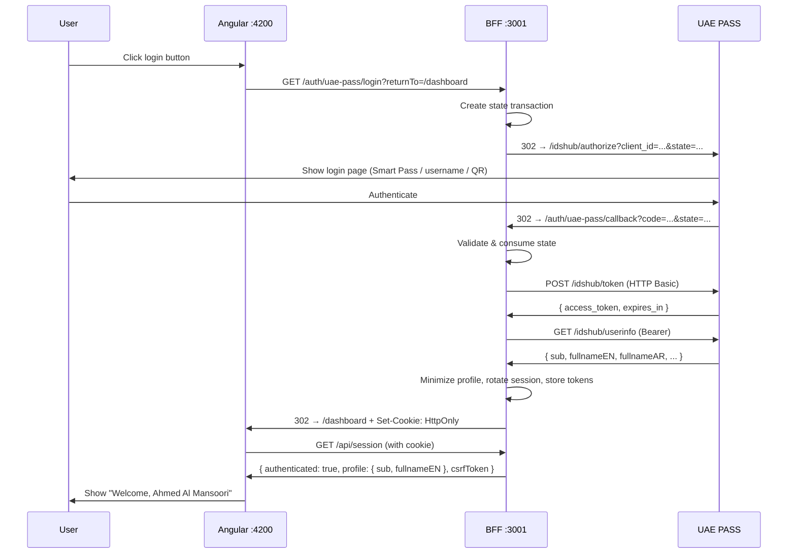
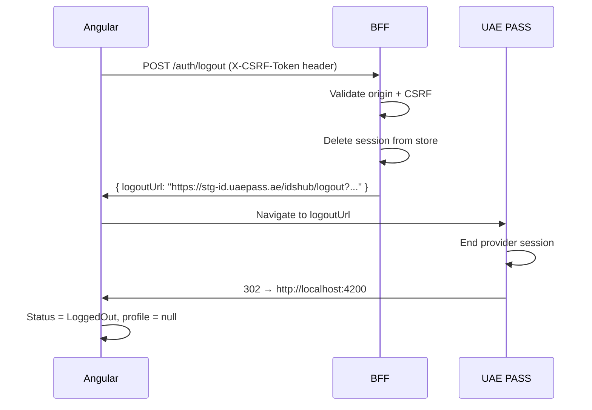
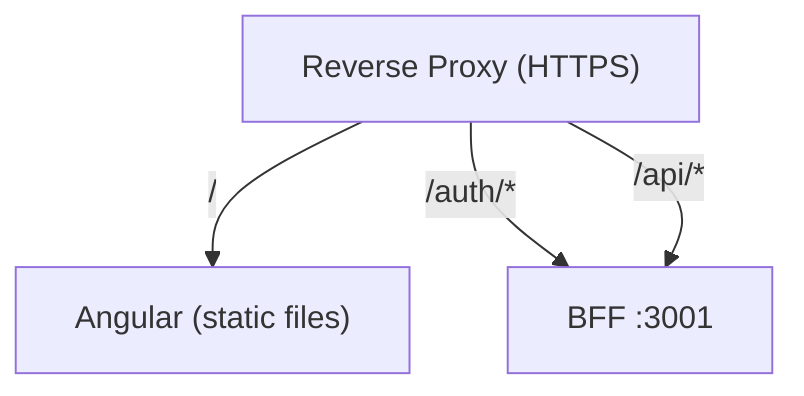

# Full-Stack Step-by-Step Guide

This guide walks you through setting up **both** the Angular frontend and the
Node.js/Express BFF backend from scratch, so a user can log in with UAE PASS and
see their profile.



---

## Prerequisites

| Requirement | Version |
| --- | --- |
| Node.js | `>=22.12` |
| npm | `>=10` |
| Angular CLI | `>=19.2` (optional, use `ng` commands) |
| UAE PASS staging credentials | Client ID + Secret from onboarding |

---

## Step 1: Clone & Install

```bash
git clone https://github.com/comrade1996/sensei-uaepass.git
cd sensei-uaepass
npm ci
```

This installs dependencies for the Angular library, the demo app, and the BFF.

---

## Step 2: Configure the BFF Backend

### 2.1 Environment variables

Create a `.env` file in `examples/bff/nodejs-express/` (or copy from `.env.example`):

```bash
# examples/bff/nodejs-express/.env

NODE_ENV=development
PORT=3001

# Angular app origin
APP_ORIGIN=http://localhost:4200
ALLOWED_ORIGINS=http://localhost:4200

# UAE PASS staging credentials (from your onboarding)
UAE_PASS_ENVIRONMENT=staging
UAE_PASS_CLIENT_ID=your-staging-client-id
UAE_PASS_CLIENT_SECRET=your-staging-client-secret

# Must match what you registered with UAE PASS
UAE_PASS_REDIRECT_URI=http://localhost:3001/auth/uae-pass/callback
UAE_PASS_LOGOUT_REDIRECT_URI=http://localhost:4200

# Optional: enable PKCE only if UAE PASS confirms S256 support
UAE_PASS_PKCE_ENABLED=false
```

### 2.2 Verify the BFF starts

```bash
cd examples/bff/nodejs-express
npm install
npm start
```

You should see:

```text
✅ BFF listening on http://localhost:3001
✅ Session store: MemorySessionStore (development)
✅ Health check: http://localhost:3001/health/live
```

Test the health endpoint:

```bash
curl http://localhost:3001/health/live
# { "status": "ok" }
```

### 2.3 BFF endpoint summary



| Method | Path | Purpose |
| --- | --- | --- |
| `GET` | `/auth/uae-pass/login` | Start OAuth login |
| `GET` | `/auth/uae-pass/callback` | Receive callback, exchange code |
| `GET` | `/api/session` | Return session profile |
| `POST` | `/auth/logout` | CSRF-protected logout |
| `GET` | `/health/live` | Liveness |
| `GET` | `/health/ready` | Readiness |

---

## Step 3: Configure the Angular Frontend

### 3.1 App configuration

Open `projects/demo/src/app/app.config.ts` (or create your own):

```ts
import { provideHttpClient, withFetch } from '@angular/common/http';
import { provideRouter } from '@angular/router';
import { provideUaePass, UaePassLanguageCode } from 'sensei-uaepass';

import { routes } from './app.routes';

export const appConfig = {
  providers: [
    provideHttpClient(withFetch()),
    provideRouter(routes),
    provideUaePass({
      // Point to the BFF (same origin in production, different port in dev)
      loginUrl: 'http://localhost:3001/auth/uae-pass/login',
      sessionUrl: 'http://localhost:3001/api/session',
      logoutUrl: 'http://localhost:3001/auth/logout',

      language: UaePassLanguageCode.En,
      autoRestoreSession: true,

      buttonLogos: {
        english: 'assets/UAEPASS_Sign_with_Btn_Outline_Active@2x.svg',
        arabic: 'assets/UAEPASS_Sign_with_Btn_Outline_Active_AR@2x.svg',
      },
    }),
  ],
};
```

### 3.2 Add the login button component

```ts
import { Component } from '@angular/core';
import { UaePassLoginButtonComponent } from 'sensei-uaepass';

@Component({
  standalone: true,
  imports: [UaePassLoginButtonComponent],
  template: `
    <div class="login-container">
      <h1>Welcome</h1>
      <uae-pass-login-button />
    </div>
  `,
  styles: [`
    .login-container {
      display: flex;
      flex-direction: column;
      align-items: center;
      gap: 1rem;
      padding: 2rem;
    }
  `],
})
export class LoginComponent {}
```

### 3.3 Read session state and show profile

```ts
import { Component, inject } from '@angular/core';
import { UaePassAuthService, UaePassAuthStatus } from 'sensei-uaepass';

@Component({
  standalone: true,
  template: `
    @if (auth.status() === AuthStatus.LoadingSession) {
      <p>Loading session…</p>
    }

    @if (auth.isAuthenticated()) {
      <div class="profile">
        <h2>👋 Welcome, {{ auth.profile()?.fullnameEN }}</h2>
        <p>Arabic name: {{ auth.profile()?.fullnameAR ?? 'N/A' }}</p>
        <p>User ID: {{ auth.profile()?.sub }}</p>
        <button (click)="auth.logout()">Sign out</button>
      </div>
    }

    @if (auth.status() === AuthStatus.Idle && !auth.isAuthenticated()) {
      <p>Please sign in.</p>
    }

    @if (auth.error(); as err) {
      <div class="error">
        <p>❌ {{ auth.errorCode() }}: {{ err }}</p>
        <button (click)="auth.resetError()">Dismiss</button>
      </div>
    }
  `,
})
export class DashboardComponent {
  readonly auth = inject(UaePassAuthService);
  readonly AuthStatus = UaePassAuthStatus;
}
```

### 3.4 Set up routes

```ts
import { Routes } from '@angular/router';

export const routes: Routes = [
  { path: '', loadComponent: () => import('./login.component').then(m => m.LoginComponent) },
  { path: 'dashboard', loadComponent: () => import('./dashboard.component').then(m => m.DashboardComponent) },
  { path: '**', redirectTo: '' },
];
```

> **No callback route needed.** The BFF handles the OAuth callback at
> `/auth/uae-pass/callback`. Angular never receives the authorization code.

---

## Step 4: Add UAE PASS Button Assets

Download the official UAE PASS button SVGs and place them in
`projects/demo/src/assets/`:

```text
src/assets/
├── UAEPASS_Sign_with_Btn_Outline_Active@2x.svg       (English)
└── UAEPASS_Sign_with_Btn_Outline_Active_AR@2x.svg    (Arabic)
```

These assets are referenced in `buttonLogos` configuration.

---

## Step 5: Run Both Together

From the workspace root:

```bash
npm run start:full
```

This starts:

- **Angular** on `http://localhost:4200`
- **BFF** on `http://localhost:3001`

### What happens when you click "Sign in with UAE PASS"



---

## Step 6: Test Logout

When the user clicks "Sign out":



---

## Step 7: Production Deployment

### 7.1 Same-origin (recommended)

Use a reverse proxy (nginx, Caddy, etc.) to serve both on one origin:



**nginx example:**

```nginx
server {
    listen 443 ssl;
    server_name app.example.com;

    # Angular static files
    location / {
        root /var/www/angular;
        try_files $uri $uri/ /index.html;
    }

    # BFF endpoints
    location /auth/ {
        proxy_pass http://localhost:3001;
        proxy_set_header Host $host;
        proxy_set_header X-Forwarded-Proto $scheme;
    }

    location /api/ {
        proxy_pass http://localhost:3001;
        proxy_set_header Host $host;
        proxy_set_header X-Forwarded-Proto $scheme;
    }
}
```

With same-origin, update Angular config to use relative URLs:

```ts
provideUaePass({
  loginUrl: '/auth/uae-pass/login',
  sessionUrl: '/api/session',
  logoutUrl: '/auth/logout',
});
```

### 7.2 Production BFF environment

```bash
NODE_ENV=production
APP_ORIGIN=https://app.example.com
ALLOWED_ORIGINS=https://app.example.com
UAE_PASS_ENVIRONMENT=production
UAE_PASS_CLIENT_ID=your-production-client-id
UAE_PASS_CLIENT_SECRET=your-production-client-secret
UAE_PASS_REDIRECT_URI=https://app.example.com/auth/uae-pass/callback
UAE_PASS_LOGOUT_REDIRECT_URI=https://app.example.com

# Required: shared session store
SESSION_STORE_MODULE=./stores/redis-store.js
SESSION_COOKIE_SECURE=true
SESSION_COOKIE_SAME_SITE=Lax
```

### 7.3 Redis session store

```js
// stores/redis-store.js
const { RedisSessionStore } = require('./session-store');
const redis = require('redis');

const client = redis.createClient({
  url: process.env.REDIS_URL || 'redis://localhost:6379',
});

client.on('error', (err) => console.error('Redis error:', err));

module.exports = new RedisSessionStore(client);
```

```bash
SESSION_STORE_MODULE=./stores/redis-store.js
REDIS_URL=redis://your-redis-host:6379
```

### 7.4 Production checklist

- [ ] HTTPS everywhere
- [ ] `SESSION_COOKIE_SECURE=true`
- [ ] Shared session store (Redis) configured
- [ ] `SESSION_STORE_MODULE` set
- [ ] UAE PASS production credentials in secret manager
- [ ] Origin allowlist matches your domain exactly
- [ ] Rate limits tested
- [ ] Health checks monitored
- [ ] Login, logout, session expiry, and cancellation tested in staging
- [ ] No tokens in logs (verified)

---

## Troubleshooting

### CORS errors in browser console

```text
Access to fetch at 'http://localhost:3001/api/session' from origin 'http://localhost:4200'
has been blocked by CORS policy
```

**Fix:** Ensure `ALLOWED_ORIGINS` includes `http://localhost:4200` in the BFF `.env`.

### Session always anonymous

1. Check the cookie is being sent: open DevTools → Application → Cookies
2. Verify `SameSite` and `Secure` settings match your topology
3. Ensure Angular uses `withFetch()` and credentials are included
4. Check BFF logs for `session_not_found` or `token_expired`

### `invalid_transaction` on callback

- The transaction expired (default 5 min) — retry login
- The session cookie was cleared between login and callback
- The callback was replayed (transactions are one-time-use)

### Login button does nothing

- Check `UaePassAuthService` is provided via `provideUaePass()`
- Check `provideHttpClient(withFetch())` is in providers
- Check browser console for `redirect_unavailable` error

---

## File Structure Summary

```text
sensei-uaepass/
├── projects/
│   ├── uae-pass/                 # Angular library
│   │   └── src/lib/
│   │       ├── uae-pass-auth.service.ts
│   │       ├── uae-pass-login-button.component.ts
│   │       ├── uae-pass.config.ts
│   │       ├── uae-pass.enums.ts
│   │       ├── uae-pass.types.ts
│   │       ├── uae-pass.error.ts
│   │       └── uae-pass.i18n.ts
│   └── demo/                     # Angular demo app
│       └── src/app/
│           ├── app.config.ts     # provideUaePass() config
│           ├── app.routes.ts
│           └── home/
│               ├── home.component.ts
│               └── home.component.html
├── examples/
│   └── bff/
│       └── nodejs-express/       # BFF reference implementation
│           ├── server.js
│           ├── src/
│           │   ├── app.js        # Express routes + middleware
│           │   ├── config.js     # Environment loader
│           │   ├── crypto.js     # State + PKCE utilities
│           │   ├── session-store.js
│           │   └── uae-pass-client.js
│           ├── .env.example
│           └── package.json
└── docs/                         # GitBook documentation
```

---

## Related

- [Angular Demo](angular-demo.md) — demo app details
- [Node.js/Express BFF](node-bff.md) — BFF architecture
- [BFF Endpoints Reference](bff-endpoints.md) — full endpoint API
- [Quickstart](../getting-started/quickstart.md) — condensed setup
- [Production Checklist](../deployment/production-checklist.md) — go-live checklist
