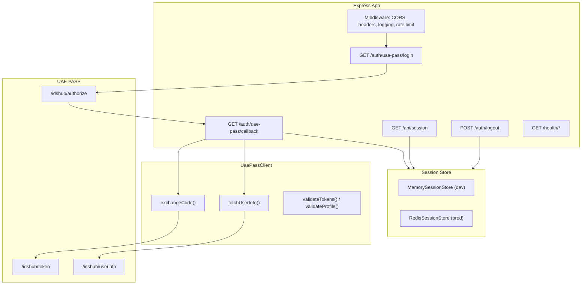

# Node.js/Express BFF

The maintained reference BFF is at `examples/bff/nodejs-express`.

## Architecture



## Features

- Server-owned state and onboarding-gated S256 PKCE
- One-time transactions and concurrent login support
- Fixed provider endpoints and registered redirect URI
- UAE PASS HTTP Basic client authentication
- Bounded, validated upstream requests (timeout, size, content-type)
- Server-side token and identity storage
- Opaque secure cookies and session rotation
- Origin and CSRF checks
- Minimized session responses
- Safe structured logs (correlation IDs, no tokens)
- Liveness, readiness, rate limits, and graceful shutdown
- A shared session-store requirement in production

## File structure

```text
examples/bff/nodejs-express/
├── server.js              # Entry point, session store loading
├── src/
│   ├── app.js             # Express app, routes, middleware
│   ├── config.js          # Environment configuration loader
│   ├── crypto.js          # State, PKCE, timing-safe comparison
│   ├── session-store.js   # MemorySessionStore + RedisSessionStore
│   └── uae-pass-client.js # UAE PASS API client + profile minimizer
├── test/
│   └── bff.test.js        # Integration tests
├── .env.example           # Environment template
├── Dockerfile             # Container build
├── healthcheck.js         # Docker health check
└── package.json
```

## Security headers set by the BFF

| Header | Value |
| --- | --- |
| `X-Content-Type-Options` | `nosniff` |
| `X-Frame-Options` | `DENY` |
| `Referrer-Policy` | `no-referrer` |
| `Cache-Control` | `no-store` |
| `Content-Security-Policy` | `default-src 'none'; frame-ancestors 'none'` |
| `Strict-Transport-Security` | `max-age=31536000; includeSubDomains` (production only) |

## Rate limits

| Endpoint | Max requests | Window |
| --- | --- | --- |
| `/auth/uae-pass/login` | 10 | 15 minutes |
| `/auth/uae-pass/callback` | 30 | 15 minutes |
| `/api/session` | 120 | 15 minutes |
| `/auth/logout` | 20 | 15 minutes |

## Running

```bash
cd examples/bff/nodejs-express
npm install
npm start
```

Or from the workspace root:

```bash
npm run start:bff
```

## Docker

```bash
npm run docker:bff
npm run docker:run
```

The published contract is documented in
[UAE PASS Web Contract](../security/uae-pass-contract.md). Client-specific redirect
URIs, scopes, profile attributes, and optional PKCE support still require onboarding
confirmation.
