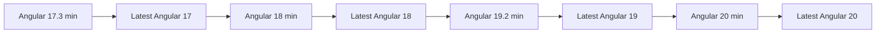

# Angular Compatibility

## Supported versions

| Sensei UAE PASS | Angular | RxJS | Node.js | Status |
| --- | --- | --- | --- | --- |
| 3.x | 17.3–20.x | 7.8.x | 22.12+, 24.x | ✅ Current |
| 2.x | 19.2–20.x | 7.8.x | 22.12+, 24.x | ⚠️ Maintenance |
| 1.x | 19.x | 7.8.x | Angular 19 supported | ❌ EOL |

## How compatibility is maintained

The package uses Angular partial compilation and declares Angular as a peer dependency.
Applications must install compatible `@angular/core` and `@angular/common` versions.

CI validates the workspace across eight Angular configurations:

## Before upgrading Angular

1. Verify the package peer range (`>=17.3.0 <21.0.0`)
2. Run the application's complete test suite
3. Check for breaking changes in Angular's signal or HttpClient APIs
4. Test BFF integration end-to-end after upgrade

## Node.js requirement

Node.js 22.12 or newer is required. The BFF uses modern Node.js features including
`structuredClone`, `randomUUID`, and `AbortController`.
