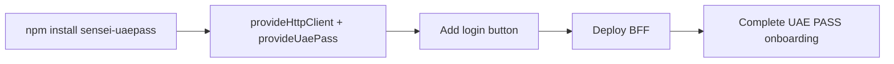

# Installation

## Install the package

```bash
npm install sensei-uaepass
```

Or with yarn:

```bash
yarn add sensei-uaepass
```

Or with pnpm:

```bash
pnpm add sensei-uaepass
```

## Peer dependencies

| Package | Version |
| --- | --- |
| `@angular/core` | `>=19.2.0 <21.0.0` |
| `@angular/common` | `>=19.2.0 <21.0.0` |
| `rxjs` | `7.8.x` |

Angular is declared as a peer dependency so your application controls the version.

## Enable HttpClient

The authentication service uses `HttpClient` to call the BFF session and logout endpoints.
Enable it with `withFetch()` for modern fetch-based requests:

```ts
import { provideHttpClient, withFetch } from '@angular/common/http';
import { provideUaePass } from 'sensei-uaepass';

export const appConfig = {
  providers: [
    provideHttpClient(withFetch()),
    provideUaePass({
      loginUrl: '/auth/uae-pass/login',
      sessionUrl: '/api/session',
      logoutUrl: '/auth/logout',
    }),
  ],
};
```

## Verify the installation

```ts
import { UaePassAuthService } from 'sensei-uaepass';

// This should resolve without errors
const auth = inject(UaePassAuthService);
console.log(auth.status()); // 'idle'
```

## What you also need

The Angular package is only the client side. You also need a Backend-for-Frontend (BFF)
that handles OAuth with UAE PASS. The reference implementation is at
[`examples/bff/nodejs-express`](https://github.com/comrade1996/sensei-uaepass/tree/main/examples/bff/nodejs-express).



Next: [Quickstart](quickstart.md)
