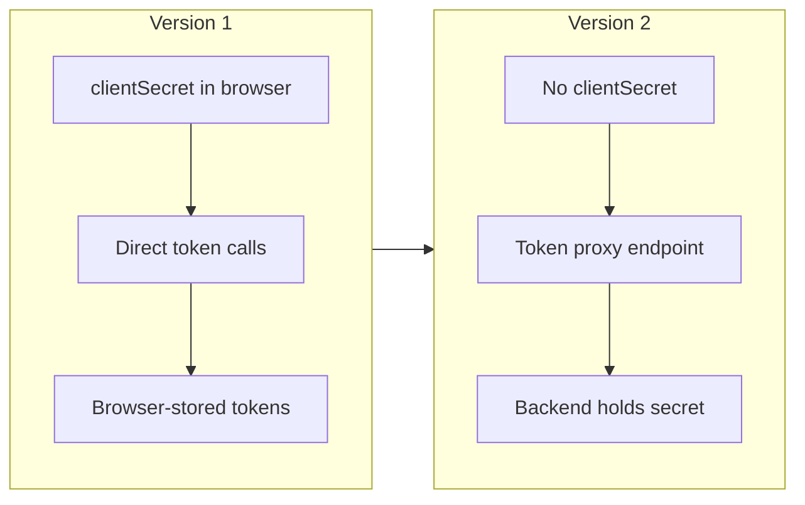

# Migrate to Version 2

> Historical guide for applications that must remain on the legacy 2.x line. New
> integrations should use version 3 and the [version 3 migration
> guide](migration-v3.md).

Version 2 is a security-focused major release that removed the browser `clientSecret`
and required backend token and user-info proxy endpoints.

## Required changes

1. Remove `clientSecret` from all Angular configuration. A browser application cannot
   keep a client secret.
2. Configure both `tokenProxyUrl` and `userInfoProxyUrl`; these endpoints are now required.
3. Update backend endpoints to keep the UAE PASS client ID and secret in server-side
   environment variables or a secret manager.
4. Review storage mode. Persistence defaults to `none`; select session or local storage
   only after assessing the application's risk.
5. Handle `errorCode()` when application behavior depends on the failure category.
6. Confirm callback URLs match the configured redirect origin and path exactly.

## Breaking security behavior

- Authentication fails when Web Crypto or session storage is unavailable.
- Callback state is stored per transaction and expires after ten minutes.
- Persisted access tokens with elapsed `expires_in` values are removed instead of
  restoring an authenticated session.
- Direct browser calls to UAE PASS token and user-information endpoints are removed.

## From v1 to v2

## From v2 to v3

If you are ready to move to the BFF-first architecture, see
[Migration to Version 3](migration-v3.md). Version 3 removes all browser token handling
entirely.
