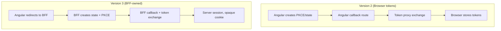

# Migrate to Version 3

Version 3 is intentionally breaking. It removes the browser-token flow and moves all
OAuth transactions to the BFF.

## What changed



## Remove from Angular

- `clientId`, `redirectUri`, `isProduction`, `scope`, and storage configuration
- `tokenProxyUrl` and `userInfoProxyUrl`
- `UaePassCallbackComponent` and the Angular OAuth callback route
- Browser token/profile persistence and every use of `auth.tokens`
- Calls to `redirectToAuthorization`, `handleRedirectCallback`, `exchangeToken`, and
  `fetchUserInfo`

## Configure

```ts
import { provideHttpClient, withFetch } from '@angular/common/http';
import { provideUaePass } from 'sensei-uaepass';

export const appConfig = {
  providers: [
    provideHttpClient(withFetch()),
    provideUaePass({
      loginUrl: '/auth/uae-pass/login',
      sessionUrl: '/api/session',
      logoutUrl: '/auth/logout',
    }),
  ],
};
```

## API replacement map

| Version 2 | Version 3 |
| --- | --- |
| Angular creates PKCE/state | BFF creates state and optional onboarding-approved PKCE |
| Angular callback route | Registered BFF callback |
| Token and user-info proxy | Server-owned OAuth transaction |
| `redirectToAuthorization()` | `login(returnPath?)` |
| `handleRedirectCallback()` | BFF callback endpoint |
| `auth.tokens()` | Removed — no public token signal |
| Browser tokens/profile | Opaque cookie and minimized session profile |
| Local browser logout | CSRF-protected BFF invalidation followed by UAE PASS logout |

## Migration example

### Before (v2)

```ts
// v2 — browser-managed OAuth
provideUaePass({
  clientId: 'your-client-id',
  redirectUri: 'http://localhost:4200/callback',
  isProduction: false,
  scope: 'urn:uae:digitalid:profile:general',
  tokenProxyUrl: '/api/token',
  userInfoProxyUrl: '/api/userinfo',
  storage: 'session',
});

// Callback component
@Component({
  template: `<app-callback />`,
})
export class CallbackComponent {
  ngOnInit() {
    this.auth.handleRedirectCallback();
  }
}
```

### After (v3)

```ts
// v3 — BFF-managed OAuth
provideUaePass({
  loginUrl: '/auth/uae-pass/login',
  sessionUrl: '/api/session',
  logoutUrl: '/auth/logout',
});

// No callback component needed — BFF handles the callback
```

## Deploy a BFF

The reference BFF is under `examples/bff/nodejs-express`. It handles:

- Login initiation with state and optional PKCE
- OAuth callback and token exchange
- User info retrieval and profile minimization
- Session management with opaque cookies
- CSRF-protected logout

See the [BFF Architecture](../security/bff-architecture.md) and
[Node.js BFF example](../examples/node-bff.md) for details.
