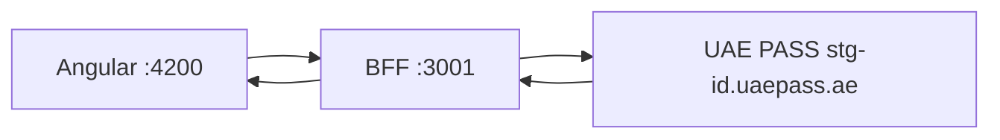
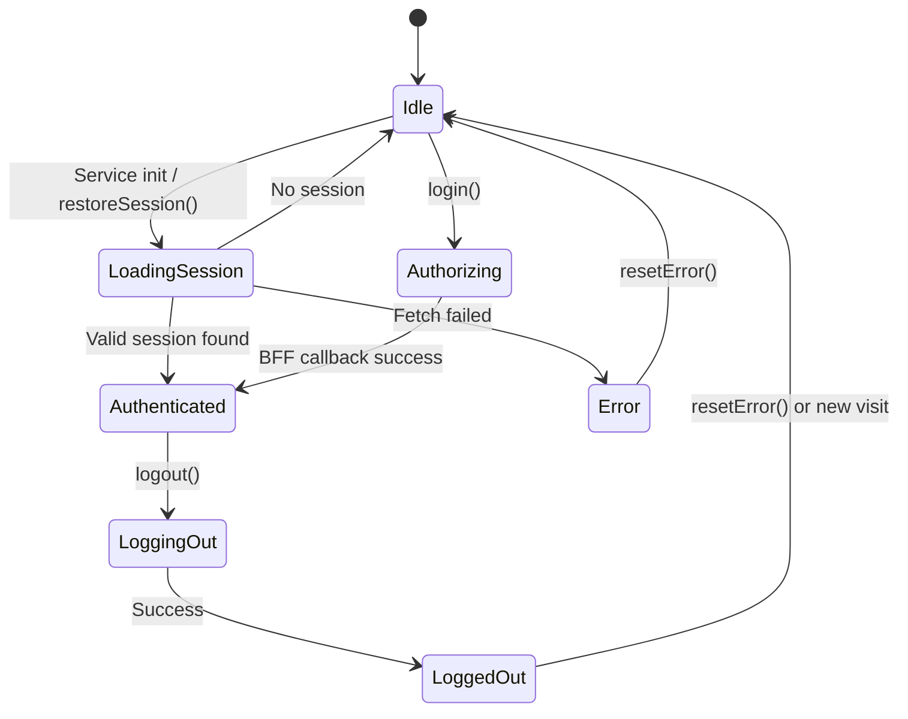

# Quickstart

This guide walks through the four steps to get UAE PASS authentication working in your
Angular application.

## Step 1: Configure Angular

Register `provideHttpClient` and `provideUaePass` in your app config:

```ts
import { provideHttpClient, withFetch } from '@angular/common/http';
import { provideRouter } from '@angular/router';
import { provideUaePass } from 'sensei-uaepass';

import { routes } from './app.routes';

export const appConfig = {
  providers: [
    provideHttpClient(withFetch()),
    provideRouter(routes),
    provideUaePass({
      loginUrl: '/auth/uae-pass/login',
      sessionUrl: '/api/session',
      logoutUrl: '/auth/logout',
      language: 'en',
    }),
  ],
};
```

> If your BFF runs on a different origin (e.g. `http://localhost:3001` during development),
> use absolute URLs:
> ```ts
> provideUaePass({
>   loginUrl: 'http://localhost:3001/auth/uae-pass/login',
>   sessionUrl: 'http://localhost:3001/api/session',
>   logoutUrl: 'http://localhost:3001/auth/logout',
> })
> ```

## Step 2: Add the login button

```ts
import { Component } from '@angular/core';
import { UaePassLoginButtonComponent } from 'sensei-uaepass';

@Component({
  standalone: true,
  imports: [UaePassLoginButtonComponent],
  template: `
    <div class="login-page">
      <h1>Welcome</h1>
      <uae-pass-login-button />
    </div>
  `,
})
export class LoginComponent {}
```

When clicked, the button calls `UaePassAuthService.login()`, which redirects the browser
to your BFF login endpoint. The BFF then redirects to UAE PASS.

## Step 3: Run a BFF

Use `examples/bff/nodejs-express` as the reference. The registered UAE PASS redirect
URI must point to the BFF callback, not to an Angular route:

```text
https://bff.example.com/auth/uae-pass/callback
```

The Angular application does not need an OAuth callback route.

### Start locally

```bash
# Set environment variables (see examples/bff/nodejs-express/.env.example)
# Then start both Angular and the BFF:
npm run start:full
```



## Step 4: Read session state

```ts
import { Component, inject } from '@angular/core';
import { UaePassAuthService } from 'sensei-uaepass';

@Component({
  standalone: true,
  template: `
    @if (auth.isAuthenticated()) {
      <p>Welcome, {{ auth.profile()?.fullnameEN }}</p>
      <button (click)="auth.logout()">Sign out</button>
    } @else {
      <p>Please sign in.</p>
    }
  `,
})
export class DashboardComponent {
  readonly auth = inject(UaePassAuthService);
}
```

### Session lifecycle



## What's next

- [Configuration](../configuration/uaepass-config.md) — all config options
- [Login Button](../components/login-button.md) — component inputs and outputs
- [Authentication Service](../services/auth-service.md) — signals and methods
- [BFF Architecture](../security/bff-architecture.md) — how the BFF works
