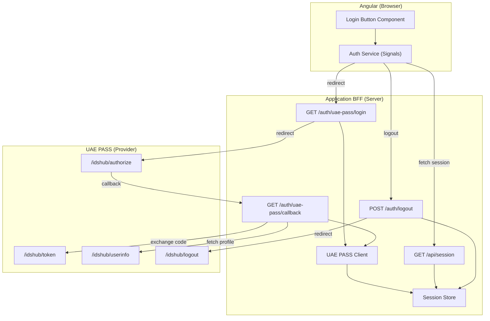
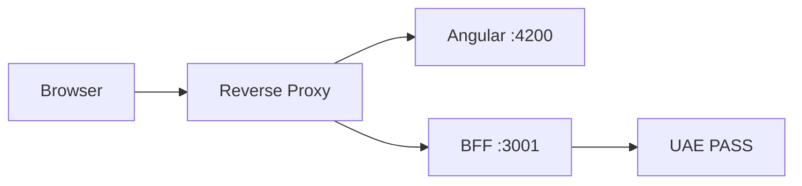
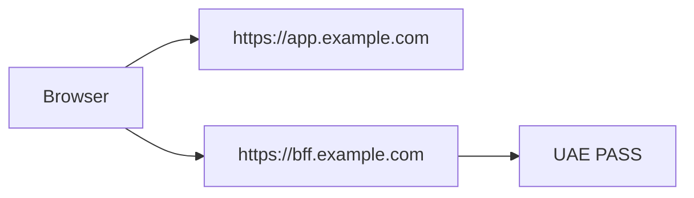

# BFF Architecture

The Backend-for-Frontend (BFF) is the OAuth and identity security boundary. It owns
all server-side interactions with UAE PASS.

## Architecture diagram



## Responsibility split

| Angular (Browser) | BFF (Server) |
| --- | --- |
| Render login and session UI | Generate state and optional onboarding-approved S256 PKCE |
| Redirect to BFF login | Store one-time transactions |
| Read minimized session profile | Receive the registered callback |
| Send CSRF token for logout | Exchange codes, call user info, and initiate UAE PASS logout |
| Never handle provider tokens | Validate required identity fields |
| Never persist identity state | Store tokens in the server session |

## Endpoints

| Method | Path | Purpose |
| --- | --- | --- |
| `GET` | `/auth/uae-pass/login` | Start login, redirect to UAE PASS |
| `GET` | `/auth/uae-pass/callback` | Receive OAuth callback, exchange code |
| `GET` | `/api/session` | Return minimized session profile |
| `POST` | `/auth/logout` | CSRF-protected session invalidation |
| `GET` | `/health/live` | Liveness probe |
| `GET` | `/health/ready` | Readiness probe |

## Cookie policy

The reference implementation uses an opaque `HttpOnly` cookie:

| Attribute | Default | Notes |
| --- | --- | --- |
| `HttpOnly` | Always | Prevents JavaScript access |
| `Secure` | `true` in production | Requires HTTPS |
| `SameSite` | `Lax` | `None` requires `Secure` |
| `Path` | `/` | — |
| `Max-Age` | `sessionTtlMs / 1000` | Default 8 hours |

`SameSite=None` is rejected unless `Secure` is enabled.

## Session store

| Store | Use case |
| --- | --- |
| `MemorySessionStore` | Local development only — production startup rejects it |
| `RedisSessionStore` | Production — adapter for `node-redis` compatible client |

Production requires `SESSION_STORE_MODULE` pointing to a module that exports a shared
session store instance.

## Deployment models

### Same-origin (recommended)



```text
https://app.example.com/             Angular
https://app.example.com/auth/*       BFF
https://app.example.com/api/session  BFF
```

### Cross-origin

If Angular and the BFF use different origins, configure:

- An exact origin allowlist (never `*` with credentials)
- Credentialed CORS (`Access-Control-Allow-Credentials: true`)
- Cookie attributes matching the topology
- CSRF behavior for cross-origin requests



> Never use a wildcard origin with credentials.
