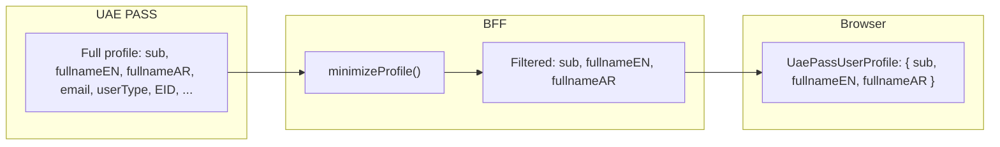

# Data Minimization

The BFF returns only the minimum identity fields the application needs. The browser
never sees the complete UAE PASS profile.

## Data flow



## Default minimized fields

The reference BFF returns only:

| Field | Type | Condition |
| --- | --- | --- |
| `sub` | `string` | Always (stable user identifier) |
| `fullnameEN` | `string` | When present in upstream response |
| `fullnameAR` | `string` | When present in upstream response |

## What the browser never sees

Never log or expose:

- Authorization codes
- Access tokens
- Refresh tokens
- ID tokens
- Session cookies
- CSRF tokens
- Emirates IDs
- Complete provider profiles

## Extending the profile

Add fields only when a documented application requirement exists. Update both the BFF
`minimizeProfile()` function and the Angular `UaePassUserProfile` interface:

```ts
// Angular: extend the interface
interface UaePassUserProfile {
  sub: string;
  fullnameEN?: string;
  fullnameAR?: string;
  email?: string;        // added per application requirement
  [key: string]: unknown;
}
```

```js
// BFF: add the field to minimizeProfile()
function minimizeProfile(profile) {
  return {
    sub: profile.sub,
    ...(typeof profile.fullnameEN === 'string' ? { fullnameEN: profile.fullnameEN } : {}),
    ...(typeof profile.fullnameAR === 'string' ? { fullnameAR: profile.fullnameAR } : {}),
    ...(typeof profile.email === 'string' ? { email: profile.email } : {}),
  };
}
```

## Documentation requirements

For every retained field, document:

- **Business purpose** — why the application needs this field
- **Authorized readers** — who can access this data
- **Storage location** — where it is stored and for how long
- **Masking rules** — how it is masked in logs and UI
- **Retention period** — when it is deleted
- **Deletion process** — how deletion is executed
- **Audit requirements** — what access is logged

The demo intentionally does not display Emirates ID, raw provider JSON, or tokens.
