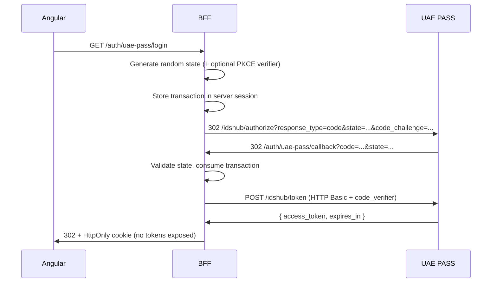
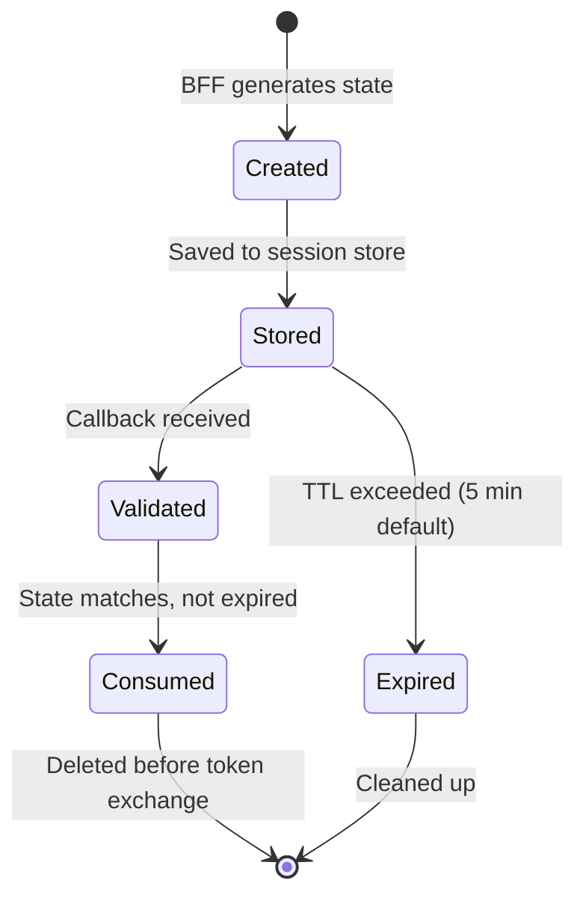

# OAuth 2.0 and PKCE

Version 3 moves the complete OAuth transaction to the BFF. The browser never
participates in OAuth directly.

## OAuth 2.0 Authorization Code flow



## Transaction lifecycle



## PKCE details

1. The BFF always generates cryptographically random state.
2. It stores the transaction in the server-side session.
3. When `UAE_PASS_PKCE_ENABLED=true`, it also stores a verifier and sends only its
   S256 challenge to UAE PASS.
4. The registered callback returns to the BFF.
5. The BFF validates and consumes the transaction before exchanging the code.
6. The browser never receives a verifier, authorization code, or token response.

### S256 PKCE computation

```text
verifier  = randomBase64Url(64)           // 64 random bytes, base64url-encoded
challenge = SHA256(verifier) → base64url   // sent to /authorize
```

The verifier is sent only to the token endpoint, never to the browser.

Transactions are short-lived (5 min default), one-time-use, bound to the initiating
session, and safe under concurrent login attempts.

## When to enable PKCE

The published UAE PASS web contract does not document PKCE parameters. PKCE is
disabled by default and must be enabled only after the UAE PASS onboarding team
confirms S256 support for the registered client.

```bash
# Enable PKCE only after onboarding confirmation
UAE_PASS_PKCE_ENABLED=true
```

> Even without PKCE, state remains cryptographically random, session-bound,
> short-lived, and single-use. The confidential client secret provides the primary
> client authentication.
