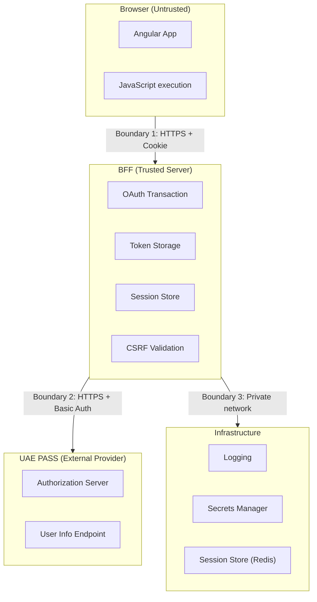

# Threat Model

## Protected assets

- UAE PASS client secret
- Authorization codes and PKCE verifiers when PKCE is enabled
- Access, refresh, and ID tokens
- Complete UAE PASS identity responses
- Application sessions and CSRF tokens

## Trust boundaries

1. **Browser to application BFF** — untrusted client, HTTPS, opaque cookie
2. **BFF to UAE PASS** — server-to-server, HTTPS, HTTP Basic auth
3. **BFF to shared session store** — private network, encrypted at rest
4. **Deployment and logging infrastructure** — metadata-only logs

## Primary threats and controls

| Threat | Controls |
| --- | --- |
| XSS steals provider tokens | Provider tokens never enter browser-visible state or storage |
| Login CSRF or callback substitution | Random state, session binding, fixed callback, one-time consumption |
| Authorization-code interception | Confidential-client authentication; optional S256 PKCE when UAE PASS enables it |
| Callback replay | Transaction is deleted before token exchange |
| Session fixation | Session identifier rotates after verified login |
| CSRF logout | Exact origin check and in-memory CSRF token |
| Open redirect | Only local bounded return paths are accepted |
| Token proxy abuse | No browser-supplied code, verifier, redirect URI, or bearer-token API |
| Log disclosure | Structured metadata-only logs and correlation IDs |
| Stolen session cookie | Random opaque ID, `HttpOnly`, `Secure`, bounded TTL, store invalidation |
| Upstream denial or malformed data | Timeouts, abort, size/type validation, fail-closed parsing |
| Multi-instance inconsistency | Shared production session store |
| Rate limit bypass | Per-endpoint rate limits (login: 10/15min, callback: 30/15min, session: 120/15min) |

## Attack surface diagram

```mermaid
graph LR
    subgraph Exposed["Exposed Endpoints"]
        E1["GET /auth/uae-pass/login"]
        E2["GET /auth/uae-pass/callback"]
        E3["GET /api/session"]
        E4["POST /auth/logout"]
    end

    subgraph Protected["Protected Assets"]
        P1["Client Secret"]
        P2["Tokens"]
        P3["Session Store"]
        P4["CSRF Tokens"]
    end

    subgraph Controls["Security Controls"]
        C1["Rate Limiting"]
        C2["State Validation"]
        C3["Origin Allowlist"]
        C4["CSRF Check"]
        C5["Cookie Policy"]
        C6["Input Validation"]
    end

    Exposed --> Controls
    Controls --> Protected
```

## Residual risks

- XSS can still act as the signed-in user while malicious code executes.
- Cookie and CSRF policy must match the actual same-origin or cross-origin topology.
- The UAE PASS contract and required identity attributes vary by onboarding agreement.
- A compromised BFF or session store can expose provider tokens and identity data.

Review this model whenever session topology, provider contract, scopes, profile
fields, or logout behavior changes.
