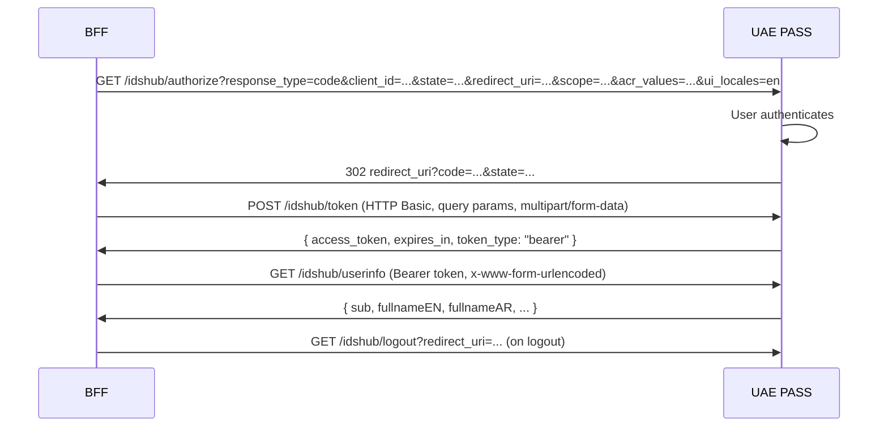
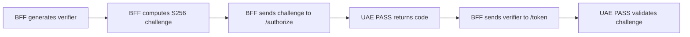

# UAE PASS Web Contract

The reference BFF was checked against the published UAE PASS Web Integration
documentation on July 30, 2026.

## OAuth flow overview



## Confirmed contract

| Concern | Published UAE PASS requirement |
| --- | --- |
| Environments | `stg-id.uaepass.ae` for staging and `id.uaepass.ae` for production |
| Authorization | `GET /idshub/authorize` with `response_type=code`, registered `client_id`, `scope`, `state`, `redirect_uri`, `acr_values`, and optional `ui_locales` |
| Callback | Registered redirect URI receives `code` and the original `state` |
| Token | `POST /idshub/token`; parameters are in the query string |
| Client authentication | HTTP Basic using the UAE PASS client ID and secret |
| Token content type | `multipart/form-data; charset=UTF-8` |
| User information | `GET /idshub/userinfo` with bearer authentication and `application/x-www-form-urlencoded` content type |
| Logout | Browser navigation to `/idshub/logout?redirect_uri=<registered relying-party URL>` |
| Languages | `ui_locales=en` or `ui_locales=ar` |

The BFF fixes environment endpoints server-side, sends the identical configured
redirect URI in authorization and token requests, validates and consumes `state`,
uses HTTP Basic at the token endpoint, and keeps the bearer token server-side.

The UAE PASS Authentication APIs Postman Collection V2 supplied with the integration
materials confirms the token query parameters, Basic authentication, empty multipart
body, and bearer-authenticated user-info request.

## Provider endpoints

| Environment | Base URL |
| --- | --- |
| Staging | `https://stg-id.uaepass.ae` |
| Production | `https://id.uaepass.ae` |

| Endpoint | Method | Path |
| --- | --- | --- |
| Authorization | `GET` | `/idshub/authorize` |
| Token | `POST` | `/idshub/token` |
| User info | `GET` | `/idshub/userinfo` |
| Logout | `GET` | `/idshub/logout` |

## Token request example

```http
POST /idshub/token?grant_type=authorization_code&code=...&redirect_uri=...&code_verifier=... HTTP/1.1
Host: stg-id.uaepass.ae
Authorization: Basic <base64(clientId:clientSecret)>
Content-Type: multipart/form-data; charset=UTF-8
Accept: application/json
```

## User info request example

```http
GET /idshub/userinfo HTTP/1.1
Host: stg-id.uaepass.ae
Authorization: Bearer <access_token>
Content-Type: application/x-www-form-urlencoded
Accept: application/json
```

## PKCE

The published UAE PASS web contract does not list `code_challenge`,
`code_challenge_method`, or `code_verifier`. PKCE is therefore disabled by default in
the reference BFF. Set `UAE_PASS_PKCE_ENABLED=true` only after the UAE PASS onboarding
team confirms S256 support for the registered client.

This is a provider-compatibility decision, not permission to weaken transaction
handling. State remains cryptographically random, session-bound, short-lived, and
single-use.

### PKCE flow when enabled



## Onboarding-specific values

Public documentation cannot confirm values assigned to an individual service
provider. Before staging or production, obtain and test:

- the issued client ID and secret;
- the exact registered login and logout redirect URIs;
- approved scopes and returned profile attributes;
- the required `acr_values`;
- whether S256 PKCE is enabled for the client;
- any network, certificate, or allowlisting requirements.

## Official sources

- [Web endpoints](https://docs.uaepass.ae/feature-guides/authentication/web-application/endpoints)
- [Authorization code](https://docs.uaepass.ae/feature-guides/authentication/web-application/1.-obtaining-the-oauth2-access-code)
- [Access token](https://docs.uaepass.ae/feature-guides/authentication/web-application/2.-obtaining-the-access-token)
- [User information](https://docs.uaepass.ae/feature-guides/authentication/web-application/3.-obtaining-authenticated-user-information-from-the-access-token)
- [Logout](https://docs.uaepass.ae/feature-guides/authentication/web-application/4.-web-single-sign-on-sso-and-logout-user-session-from-uae-pass)
