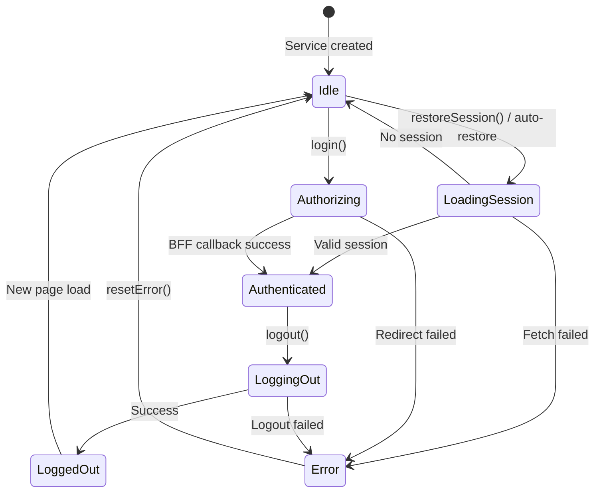

# Authentication Service

`UaePassAuthService` is an injectable service (`providedIn: 'root'`) that manages
authentication state via **Angular Signals**.

## Signals

| Signal | Type | Description |
| --- | --- | --- |
| `status` | `Signal<UaePassAuthStatus>` | Session lifecycle status |
| `profile` | `Signal<UaePassUserProfile \| null>` | Minimized, runtime-validated BFF profile |
| `isAuthenticated` | `Signal<boolean>` | `true` only when status is `Authenticated` and profile has valid `sub` |
| `error` | `Signal<string \| null>` | Safe client-side error message |
| `errorCode` | `Signal<UaePassErrorCode \| null>` | Typed error code |

There is deliberately **no public token signal**.

### `UaePassAuthStatus` values

| Value | Description |
| --- | --- |
| `Idle` | Initial state or after session restoration finds no session |
| `LoadingSession` | Restoring session from BFF |
| `Authorizing` | Redirecting to BFF login |
| `Authenticated` | Valid session with profile |
| `LoggingOut` | Calling BFF logout |
| `Error` | An operation failed |
| `LoggedOut` | Session ended successfully |

### Reading state in components

```ts
import { Component, inject } from '@angular/core';
import { UaePassAuthService, UaePassAuthStatus } from 'sensei-uaepass';

@Component({
  standalone: true,
  template: `
    <p>Status: {{ auth.status() }}</p>
    <p>Authenticated: {{ auth.isAuthenticated() }}</p>
    <p>Name: {{ auth.profile()?.fullnameEN ?? 'N/A' }}</p>
    @if (auth.error()) {
      <p>Error: {{ auth.error() }} ({{ auth.errorCode() }})</p>
    }
  `,
})
export class SessionComponent {
  readonly auth = inject(UaePassAuthService);
  readonly AuthStatus = UaePassAuthStatus;
}
```

## Methods

### `login(returnPath?: string): void`

Redirects the browser to the BFF login endpoint. Only a local return path is sent.

```ts
const auth = inject(UaePassAuthService);

// Return to current page after auth
auth.login();

// Return to a specific path after auth
auth.login('/dashboard');
```

The `returnPath` is validated:

- Must start with `/`
- Must not start with `//`
- Must not contain `\`
- Falls back to `/` if invalid

### `restoreSession(): Promise<boolean>`

Calls the BFF session endpoint with credentials. An authenticated response requires a
non-empty stable `sub` and a CSRF token.

```ts
const auth = inject(UaePassAuthService);

// Called automatically on service init when autoRestoreSession is true
const isAuthenticated = await auth.restoreSession();
```

### `logout(): Promise<void>`

Posts to the BFF logout endpoint using the in-memory CSRF token. The BFF invalidates
the application session and returns the official UAE PASS logout URL. The browser
navigates to that URL so both sessions are ended.

```ts
const auth = inject(UaePassAuthService);

async signOut(): Promise<void> {
  await auth.logout();
}
```

### `resetError(): void`

Clears current client-side error state.

```ts
const auth = inject(UaePassAuthService);

// After displaying an error to the user
auth.resetError();
```

## Session lifecycle



## Related

- [Error Handling](error-handling.md)
- [Configuration](../configuration/uaepass-config.md)
- [Login Button](../components/login-button.md)
