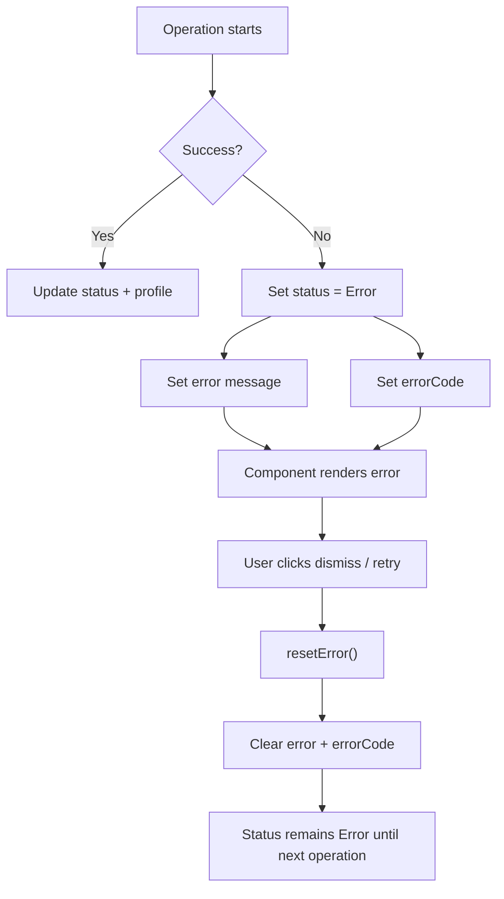

# Error Handling

The library provides typed error codes through the `UaePassErrorCode` enum and
reactive error signals on `UaePassAuthService`.

## Error signals

| Signal | Type | Description |
| --- | --- | --- |
| `error` | `Signal<string \| null>` | Human-readable error message |
| `errorCode` | `Signal<UaePassErrorCode \| null>` | Typed error code for conditional logic |

## `UaePassErrorCode` enum

| Code | Value | When | Recoverable? |
| --- | --- | --- | --- |
| `InvalidConfiguration` | `invalid_configuration` | `provideUaePass()` validation | No — fix config |
| `RedirectUnavailable` | `redirect_unavailable` | `login()` called without `window.location` | No — SSR issue |
| `SessionFetchFailed` | `session_fetch_failed` | `restoreSession()` HTTP failure or timeout | Yes — retry |
| `InvalidSessionResponse` | `invalid_session_response` | BFF returned malformed response | Yes — re-login |
| `AuthorizationFailed` | `authorization_failed` | Login redirect failed | Yes — retry login |
| `LogoutFailed` | `logout_failed` | Logout HTTP failure or rejection | Yes — retry logout |

## Displaying errors

```ts
import { Component, inject } from '@angular/core';
import { UaePassAuthService, UaePassErrorCode } from 'sensei-uaepass';

@Component({
  standalone: true,
  template: `
    @if (auth.error(); as err) {
      <div class="alert alert-danger" role="alert">
        <strong>{{ auth.errorCode() }}</strong>: {{ err }}
        <button type="button" (click)="auth.resetError()">Dismiss</button>
      </div>
    }
  `,
})
export class ErrorDisplayComponent {
  readonly auth = inject(UaePassAuthService);
}
```

## Conditional error handling

```ts
import { UaePassErrorCode } from 'sensei-uaepass';

// In a component or guard
handleError(): void {
  switch (this.auth.errorCode()) {
    case UaePassErrorCode.SessionFetchFailed:
      // Network error — show retry button
      this.showRetry = true;
      break;
    case UaePassErrorCode.InvalidSessionResponse:
      // BFF response corrupted — suggest re-login
      this.showReloginMessage = true;
      break;
    case UaePassErrorCode.LogoutFailed:
      // Logout failed — show retry
      this.showLogoutRetry = true;
      break;
    default:
      // Unknown error
      this.showGenericError = true;
  }
}
```

## Error flow



## `UaePassError` class

```ts
class UaePassError extends Error {
  readonly name = 'UaePassError';
  constructor(
    readonly code: UaePassErrorCode,
    message: string,
    readonly originalError?: unknown
  ) {}
}
```

The `toUaePassError()` helper normalizes unknown errors into `UaePassError` instances:

```ts
import { toUaePassError, UaePassErrorCode } from 'sensei-uaepass';

try {
  await someOperation();
} catch (error) {
  const normalized = toUaePassError(error, UaePassErrorCode.SessionFetchFailed, 'Fallback message');
  console.log(normalized.code);  // UaePassErrorCode.SessionFetchFailed
  console.log(normalized.message);
}
```

## Clearing errors

Call `resetError()` to clear both `error()` and `errorCode()` signals:

```ts
const auth = inject(UaePassAuthService);

// After user acknowledges the error
auth.resetError();
```

> `resetError()` does not change `status()`. If the status is `Error`, it remains
> `Error` until the next operation (`login()`, `restoreSession()`, or `logout()`)
> sets a new status.

## Related

- [Authentication Service](auth-service.md)
- [Authentication and Session Errors](../troubleshooting/authentication-errors.md)
- [Common Errors](../troubleshooting/common-errors.md)
