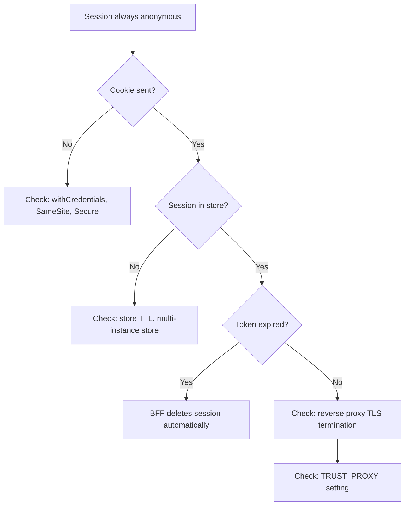

# Common Errors

## BFF errors

### `invalid_transaction`

The callback state is missing, expired, already consumed, or not bound to the
initiating session. Start a new login.

**Causes:**

- Session cookie was cleared between login initiation and callback
- Transaction expired (default 5 minutes)
- Callback was replayed (transaction is one-time-use)

### `invalid_token_response`

The provider response lacks a usable bearer token. Confirm the environment and
client-authentication contract.

**Check:**

- `UAE_PASS_ENVIRONMENT` is `staging` or `production`
- `UAE_PASS_CLIENT_ID` and `UAE_PASS_CLIENT_SECRET` are correct
- Token endpoint URL matches the environment

### `invalid_token_expiry`

The provider did not return a positive finite `expires_in`. The BFF fails closed.

### `invalid_token_type`

The provider returned a `token_type` other than `bearer`. Verify the UAE PASS contract.

### `invalid_userinfo_response`

The user info response is not a valid object or is missing `sub`.

### `missing_subject`

The user info response has no `sub` field or it is empty. This is a required field.

### `origin_rejected` or `csrf_rejected`

Confirm:

- The exact Angular origin is in `ALLOWED_ORIGINS`
- Credentialed requests include `credentials: 'include'`
- The `X-CSRF-Token` header matches the token from `/api/session`

### `upstream_timeout`

The UAE PASS provider did not respond within `UPSTREAM_TIMEOUT_MS` (default 10s).

### `upstream_unavailable`

The BFF could not reach UAE PASS. Check network connectivity, DNS, and firewall rules.

### `rate_limited`

Too many requests to an endpoint. Wait and retry. Rate limits:

| Endpoint | Limit | Window |
| --- | --- | --- |
| `/auth/uae-pass/login` | 10 | 15 min |
| `/auth/uae-pass/callback` | 30 | 15 min |
| `/api/session` | 120 | 15 min |
| `/auth/logout` | 20 | 15 min |

## Session issues

### Session is always anonymous

Check in order:

1. Cookie `Secure` and `SameSite` behavior
2. Reverse-proxy TLS termination
3. `TRUST_PROXY` setting
4. Shared store connectivity (Redis)
5. Browser credentialed requests (`withCredentials: true`)
